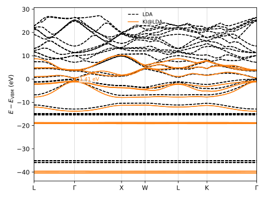

##########################################
 Band structures with spin-orbit coupling
##########################################

The KI band structure of bulk GaAs, including spin-orbit coupling. GaAs is a textbook case:
spin-orbit coupling splits the top of its valence band at :math:`\Gamma` into a
heavy-hole/light-hole pair and a split-off band, a splitting large enough
(:math:`\Delta_\text{SO} \approx 0.34` eV) that a scalar-relativistic calculation misses it
entirely.

Spin-orbit coupling changes three things about the calculation. The wavefunctions become
spinors, mixing what would otherwise be independent spin-up and spin-down states into a
single two-component object, so every Wannier function doubles into two spinor components
and a block that Wannierizes :math:`n` bands without spin-orbit now Wannierizes :math:`2n`.
Because spin is no longer a separate label, there is one set of screening parameters rather
than one per channel, unlike the collinear case in the :doc:`magnetic solids tutorial
<../../orbital_energies/magnetic/index>`. And ``kcw.x`` runs its noncollinear chain, which
the KCW paper on noncollinear Koopmans functionals derives in full :cite:`Marrazzo2024`.

This tutorial ships its screening parameters precomputed rather than computing them from
scratch. Linear-response screening solves one constrained problem per group of equivalent
orbitals, and here that is five problems, each taking on the order of a day on four MPI
ranks — reproducing them is a production calculation, not something to run while reading a
tutorial.

******************
 Pseudopotentials
******************

``kcw.x``'s noncollinear implementation only supports the local-density approximation as its
base functional, and a spin-orbit calculation needs pseudopotentials generated with full
relativistic effects included. No installable ``aiida-pseudo`` family satisfies both:
`PseudoDojo <http://www.pseudo-dojo.org/>`_ publishes full-relativistic sets only for PBE
and PBEsol, and every LDA configuration it exposes through ``aiida-pseudo install
pseudo-dojo`` is scalar-relativistic. This is the case the :doc:`installation page
<../../../installation>` has in mind when it says some pseudopotentials have to be installed
by hand.

PseudoDojo does publish LDA full-relativistic pseudopotentials — they are just not wired
into ``aiida-pseudo``'s automatic installer. They live in a separate repository, one
directory per element:

.. code-block:: console

    $ mkdir LDA-FR-GaAs
    $ curl -Lo LDA-FR-GaAs/Ga-d_r.upf https://raw.githubusercontent.com/PseudoDojo/ONCVPSP-LDA-FR-PDv0.4/main/Ga/Ga-d_r.upf
    $ curl -Lo LDA-FR-GaAs/As-d_r.upf https://raw.githubusercontent.com/PseudoDojo/ONCVPSP-LDA-FR-PDv0.4/main/As/As-d_r.upf

Install the directory as a family, naming the pseudopotential type explicitly so that the
element is read from each file's own header rather than guessed from its filename (which
here does not follow the ``ELEMENT.EXTENSION`` convention ``aiida-pseudo`` otherwise
requires):

.. code-block:: console

    $ aiida-pseudo install family LDA-FR-GaAs LDA-FR-GaAs -P pseudo.upf

A family installed this way publishes no recommended cutoffs, so the input file states
``ecutwfc`` explicitly, as :doc:`the installation page <../../../installation>` describes.

.. warning::

    The repository's own README notes that this LDA table reuses the PBE full-relativistic
    generation inputs with only the exchange-correlation functional changed, and asks that
    it be used carefully. Treat it as adequate for learning the workflow, not as a citable
    pseudopotential for production spin-orbit work.

****************
 The input file
****************

Download :download:`gaas.yaml <gaas.yaml>` and place it in an empty directory. Here it is in
full:

.. literalinclude:: gaas.yaml
    :language: yaml

.. literalinclude:: gaas.yaml
    :language: yaml
    :start-at: spin
    :end-at: spin

selects the spinor, spin-orbit-coupled formulation described above.

.. literalinclude:: gaas.yaml
    :language: yaml
    :start-at: pseudo_library
    :end-at: pseudo_library

names the family installed above.

The ``calculator_parameters.wannier90.projections`` block lists four sets of Wannier
functions: gallium and arsenic's semicore :math:`3d` shells, the four valence bands
(arsenic-centered :math:`sp^3` bonds), and the four lowest conduction bands
(gallium-centered :math:`sp^3` antibonds). ``dis_win_max`` and ``dis_froz_max`` bound the
disentanglement for the last, empty block, exactly as they would without spin-orbit coupling
— the doubled orbital count changes how many Wannier functions each block produces, not how
the projections or the disentanglement window are specified.

.. literalinclude:: gaas.yaml
    :language: yaml
    :start-at: calculate_alpha
    :end-at: calculate_alpha

skips the screening calculations,

.. literalinclude:: gaas.yaml
    :language: yaml
    :start-at: alpha_guess
    :end-before: atoms

feeding the final Hamiltonian these thirty-six precomputed screening parameters instead —
one per spinor Wannier function, in the order the projections above define. The values
repeat within each group of orbitals that ``group_orbitals_by: spread`` treated as
equivalent: all ten of the As :math:`3d` orbitals share one value, the ten Ga :math:`3d`
orbitals split into a group of four and a group of six (the crystal field lifts their
degeneracy), and the eight orbitals of each :math:`sp^3` block share one value apiece.

.. question:: Why does spin-orbit coupling leave the As :math:`3d` shell as a single
    group of ten, rather than splitting it the way it splits the Ga :math:`3d` shell?

    Both shells are core-like :math:`d` states, and spin-orbit coupling acts on all of
    them; grouping instead reflects the crystal field each site sees, which depends on
    the pseudopotential and the local bonding environment, not on spin-orbit coupling
    itself. ``group_orbitals_by: spread`` groups by wannier90 spread regardless of the
    cause, so this is a statement about this particular family and structure, not a
    general rule about :math:`d` shells.

*************************
 Running the calculation
*************************

.. warning::

    Of all the ``Quantum ESPRESSO`` codes, this workflow needs ``pw.x``, ``wannier90.x``,
    ``pw2wannier90.x`` and ``kcw.x``.

Run it with:

.. code-block:: console

    $ koopmans run gaas.yaml

With the screening parameters supplied, the workflow skips straight from Wannierization to
the final Hamiltonian: one shared SCF and NSCF calculation, one Wannierization per
projection block, ``wann2kcw`` to rotate the DFT Hamiltonian into the Wannier gauge, and
``ham`` to diagonalize the KI Hamiltonian these screening parameters define. There is no
``screen`` step at all — that step only exists when ``koopmans`` has to solve for the
screening parameters itself.

*************
 The results
*************

The final Hamiltonian step reports the KI band structure at every k-point on the requested
path, including at :math:`\Gamma`, where the valence band splits into the
heavy-hole/light-hole pair and the split-off band that spin-orbit coupling produces.

.. question:: What KI band gap does this input produce, and how does it compare with
    experiment?

    KI@LDA puts the direct gap at :math:`\Gamma` at 1.412 eV, against an LDA gap (no
    correction) of 0.156 eV — the self-interaction error a semilocal functional carries
    for GaAs is enormous, and the KI correction recovers most of it. The
    spin-orbit splitting :math:`\Delta_\text{SO}` at the top of the valence band comes
    out at 0.347 eV, close to the experimental 0.34 eV. The gap itself is 1.412 eV
    against an experimental 1.52 eV: closer than LDA gets by more than an order of
    magnitude, but short of the 1.514 eV that a fully self-consistent noncollinear KI
    calculation reaches :cite:`Marrazzo2024`. The pseudopotential family's own caveat
    above is the leading suspect for the remaining gap.

.. question:: What does spin-orbit coupling cost, on top of a scalar-relativistic KI
    calculation of the same system?

    The scalar-relativistic KI gap for the same structure, screening parameters, and
    pseudopotential family is 1.523 eV: close to the spin-orbit gap, as it should be for
    a system whose spin-orbit splitting is much smaller than its band gap. Spin-orbit
    coupling's effect here is not on the gap so much as on the valence band's shape near
    :math:`\Gamma`, where the splitting appears.

Plot the LDA and KI@LDA bands together, with the gap annotated, using ``koopmans plot
bandstructure``:

.. code-block:: console

    $ koopmans plot bandstructure \
        gaas/02-wannierize/01-bands --label LDA --style k-- \
        gaas/03-dfpt/03-ham --label "KI@LDA" --style - --gap \
        --ylim -8 10 \
        -o gaas_bandstructure.svg

    KI@LDA band structure of GaAs along L-:math:`\Gamma`-X-W-L-K-:math:`\Gamma`, against
    the LDA base functional, with the direct gap at :math:`\Gamma` annotated.
