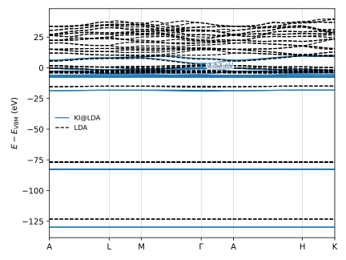

###############################################
 ZnO, and choosing Wannier blocks for yourself
###############################################

This tutorial calculates the KI band structure of wurtzite ZnO — a wide-gap
semiconductor that ordinary density-functional theory describes very badly, putting its
gap at a fraction of the measured one.

The screening parameters come from linear response in the primitive cell, evaluated on
an explicit mesh of k-points. The :doc:`silicon tutorials
<../silicon_finite_differences/index>` set out that choice: a supercell and total-energy
differences on one side, :doc:`linear response <../silicon_linear_response/index>` and
the primitive cell on the other. This page assumes their vocabulary — Wannier functions,
projections, screening parameters — and concentrates on what ZnO adds to it.

What it adds is the Wannierization. Silicon's four filled bands are one group of bands,
well separated from everything else, and one set of projections describes them. ZnO's
twenty-six are not: they fall into four groups at very different energies, and the two
empty bands we also need are buried in a continuum of higher ones. So the manifold has
to be broken into blocks, each Wannierized on its own. This tutorial gives you the
blocks; the :ref:`last section <zno-projections>` shows how to work them out yourself.

****************
 The input file
****************

Download :download:`zno.yaml <zno.yaml>` and place it in an empty directory. Here it is
in full:

.. literalinclude:: zno.yaml
    :language: yaml

.. warning::

    The cutoff and the k-point mesh in this file are deliberately rough, so that the
    workflow finishes in minutes. They are not converged! Use this file to learn the
    input format, not as something to copy-paste for production work.

Two lines in the ``workflow`` block choose the method:

.. literalinclude:: zno.yaml
    :language: yaml
    :start-at: screening_method
    :end-at: init_orbitals

The first asks for the screening parameters to be computed by linear response, with
``kcw.x``, rather than by the constrained total-energy calculations of the molecular
tutorials. The second says the variational orbitals — the orbitals the correction acts
on — are maximally localized Wannier functions. A periodic solid has no localized
orbitals to hand: the Kohn-Sham states are extended Bloch waves, and a correction
applied to them would not be a correction to anything localized in space. Wannier
functions supply them.

.. literalinclude:: zno.yaml
    :language: yaml
    :start-at: calculate_alpha
    :end-at: calculate_alpha

skips the calculation of the screening parameters altogether and uses the twenty-eight
values in ``alpha_guess`` instead, which were computed by exactly this workflow. That is
the expensive part of a Koopmans calculation, and leaving it out makes this tutorial
short. Set it back to ``true`` and the workflow will compute them for you.

.. question:: Why twenty-eight screening parameters?

    One per Wannier function, and the projections define twenty-eight of them: two Zn
    3s, six Zn 3p, two O 2s and sixteen from the hybridized Zn 3d and O 2p block, which
    is twenty-six filled ones, plus the two empty Zn 4s. Screening is an
    orbital-by-orbital affair — every orbital sits in a different environment and the
    rest of the system relaxes differently when you change its occupancy.

.. literalinclude:: zno.yaml
    :language: yaml
    :start-at: gb_correction
    :end-at: eps_inf

deal with a periodic-boundary artifact. Computing a screening parameter means perturbing
the occupancy of one orbital, which puts a charge in every periodic image of the cell,
and the Coulomb interaction between those images diverges as :math:`q \to 0`. The
Gygi-Baldereschi scheme removes the divergence, and it needs the dielectric constant of
the material, given here as a literal 5.3. Writing ``eps_inf: auto`` instead has the
workflow compute it, with ``ph.x``, at the cost of an extra step — see the
:doc:`dielectric constants tutorial <../../dielectric_constants/index>`.

The ``kpoints`` block carries two independent things: ``grid`` is the mesh the
ground-state calculation and the Wannier functions are built on, and ``path`` is the
line through the Brillouin zone the final band structure is interpolated along, written
in the usual letters for the high-symmetry points with ``G`` for :math:`\Gamma`.

Finally the projections, one entry per block of bands:

.. literalinclude:: zno.yaml
    :language: yaml
    :start-at: projections
    :end-at: Zn 4s

Each entry is a list of atom-and-angular-momentum pairs, and each defines its own
Wannierization: the first four cover the filled bands, the fifth the two empty Zn 4s
bands. The two ``dis_`` keywords that follow are energy windows for that last block; the
:ref:`last section <zno-projections>` explains where all of these numbers come from.

.. question:: Why not Wannierize all twenty-six filled bands at once?

    Because the Wannierization minimizes the spatial spread of the orbitals and nothing
    else. It is free to mix any bands you give it, and left to itself it will mix
    orbitals lying tens of electronvolts apart — the Zn 3s with the O 2p, say — if that
    buys it a little localization. The resulting Wannier functions are not recognizable
    atomic-like orbitals, and the Koopmans band structure built from them suffers.
    Splitting the manifold into blocks of bands that are well separated in energy
    forbids the mixing.

*************************
 Running the calculation
*************************

.. warning::

    Make sure you have installed ``koopmans``: see :doc:`here <../../../installation>`
    for more details.

    This workflow needs four executables registered — ``pw.x``, ``pw2wannier90.x``,
    ``wannier90.x`` and ``kcw.x``. ``kcw.x`` runs every stage of the linear-response
    part.

Run the calculation with

.. code-block:: console

    $ koopmans run zno.yaml

The terminal shows a live progress table that grows as the workflow proceeds. At the end
it reads

.. code-block:: text

     Step                                                                      Status
     Singlepoint Dfpt Workflow                                               finished
       SCF Nscf                                                              finished
         Nscf                                                                finished
       Wannierize                                                            finished
         Wannierize Emp                                                      finished
           Wannier 90                                                        finished
             Wannier 90 Pp                                                   finished
             Pw 2 Wannier 90                                                 finished
         Wannierize Occ 1                                                    finished
           ...
         Wannierize Occ 2                                                    finished
           ...
         Wannierize Occ 3                                                    finished
           ...
         Wannierize Occ 4                                                    finished
           ...
       Dfpt                                                                  finished
         Wann 2 KC                                                           finished
         Ham                                                                 finished
    Workflow completed successfully!

Three stages, in order:

---------------------------------
 The ground state (``SCF Nscf``)
---------------------------------

An LDA calculation, self-consistent on the 4×4×4 mesh and then repeated
non-self-consistently over the same mesh with symmetry switched off, which is the form
the Wannierization reads its fifty-two bands from. LDA rather than
PBE because of the pseudopotential library the input file names: the base functional a
Koopmans calculation corrects is the one its pseudopotentials were generated with.

---------------------------------
 Wannierization (``Wannierize``)
---------------------------------

One ``Wannierize`` step per block, five in all, each of which projects onto that block's
projections and then minimizes the spread. They are independent of one another and run
concurrently, so the order they appear in above is not the order of the projections. The
four filled blocks take exactly as many bands as they have projections, so there is
nothing for them to choose; the empty block has two projections and twenty-six bands to
find them in, and the two energy windows are what tells it where to look.

The five sets of Wannier functions are then stitched into one manifold — a
block-diagonal unitary matrix and one list of Wannier centres — which is what the next
stage reads.

----------------------------
 Linear response (``Dfpt``)
----------------------------

``Wann 2 KC`` converts the ``Wannier90`` output into the format ``kcw.x`` reads. Had we
asked for the screening parameters to be computed, a ``Screen`` step would follow, one
linear-response calculation per orbital; with ``calculate_alpha: false`` the workflow
goes straight to ``Ham``, which builds the Koopmans Hamiltonian, and — because the input
file gave a band path — interpolates it along that path.

*************
 The outputs
*************

The results land in a directory named after the input file, here ``zno/``, laid out to
mirror the outline above:

.. code-block:: text

    zno
    ├── 01-scf_nscf
    │   ├── 01-scf
    │   └── 02-nscf
    ├── 02-wannierize
    │   ├── 01-wannierize_emp
    │   │   ├── 01-wannier90
    │   │   │   ├── 01-wannier90_pp
    │   │   │   ├── 02-pw2wannier90
    │   │   │   └── 03-wannier90
    │   │   └── 02-extract_wannier_output_files
    │   ├── 02-wannierize_occ_1
    │   │   └── ...
    │   ├── ...
    │   └── 05-wannierize_occ_4
    │       └── ...
    ├── 03-dfpt
    │   ├── 01-prepare_kcw_wannier_files
    │   ├── 02-wann2kc
    │   └── 03-ham
    └── README

One directory per step, numbered in the order the steps ran, each holding the input
files the engine generated in ``inputs/`` and everything the calculation wrote in
``outputs/``.

.. note::

    The engine also keeps its own complete record of every calculation in its database —
    that is how an interrupted workflow resumes where it left off, and how a repeated
    calculation is served from cache instead of running twice. The ``zno/`` directory is
    a plain-file export of that record for you to read.

Two files are worth opening straight away. ``zno/03-dfpt/03-ham/inputs/file_alpharef.txt``
lists the screening parameters the final Hamiltonian was built with, one per Wannier
function, in the order the projections define them — the twenty-eight numbers from the
input file, in this run. And ``zno/03-dfpt/03-ham/outputs/aiida.kho`` is the ``kcw.x``
output, which carries the interpolated eigenvalues at each of the twenty-five points of
the band path.

**************************
 Interpreting the results
**************************

.. question:: What is the KI band gap, and what does LDA make of it?

    ZnO's gap is direct, at :math:`\Gamma`. Find the block of interpolated eigenvalues
    at ``k= 0 0 0`` in ``zno/03-dfpt/03-ham/outputs/aiida.kho``:

    .. code-block:: text

        KC interpolated eigenvalues at k=      0.0000      0.0000      0.0000

        -122.5628  -122.4515   -75.4591   -75.4485   -75.3611   -75.3509   -75.3337   -75.3291
         -11.8377   -11.0732    -0.4194    -0.4115    -0.3589     0.0332     0.0518     0.2166
           0.2211     0.4949     1.0259     1.1838     2.1654     6.3616     6.4114     7.0942
           7.1302     7.2299    10.7444    14.8412

    The twenty-sixth of these is the valence band edge and the twenty-seventh the
    conduction band edge, so the KI gap is 10.7444 − 7.2299 = 3.51 eV. Neither edge is
    higher anywhere else on the path, so the gap really is direct. For the LDA gap, look
    in the ground-state output ``zno/01-scf_nscf/01-scf/outputs/aiida.out``:

    .. code-block:: text

         highest occupied, lowest unoccupied level (ev):     9.2875    9.9769

    which is 0.69 eV.

LDA understates ZnO's gap by a factor of five; KI puts it within a few tenths of an
electronvolt of the measured 3.4 eV. A converged calculation gives 3.6 eV
:cite:`Colonna2022`; the difference is the coarse cutoff and mesh this tutorial uses to
stay quick.

Nothing so far has drawn a picture. ``koopmans plot`` does, given the directory the run
wrote:

.. code-block:: console

    $ koopmans plot bandstructure zno/ -o zno_bandstructure.svg

    The KI band structure of ZnO along the ``ALMGAHK`` path, with the valence band edge
    at zero.

The five blocks of projections are visible in it. Reading the figure from the bottom:
two bands at −130 eV, six at −83 eV, two around −19 eV, then the sixteen filling the
range from −8 eV up to zero — and above the gap, the two the empty block supplies. Those
separations are the whole reason the manifold was split, and the :ref:`last section
<zno-projections>` works back from them to the projections themselves.

.. note::

    Two things this figure is not. It is not a comparison against LDA: for that, pass
    ``koopmans plot bandstructure`` both run directories at once and it puts them on one
    set of axes with a shared energy zero — but the LDA bands along this path need a
    ``dft_bands`` run, which the next section sets up anyway. And it is not zoomed: the
    semicore bands set the vertical scale and the command has no y-range option, which
    is why the gap above is read off the eigenvalues rather than off the picture.

.. warning::

    The two empty Wannier functions are the delicate part of this calculation. They are
    disentangled from twenty-six bands rather than taken from a closed group, and the
    localization problem they solve has more than one solution: runs that start from
    slightly different guesses can settle on different Wannier functions and move the
    conduction bands by a few tenths of an electronvolt. The filled manifold has no such
    freedom and is reproducible. Treat the conduction bands of a disentangled manifold —
    and the gap that depends on them — as the quantity to check convergence of most
    carefully.

.. _zno-projections:

**********************************
 Choosing the projections yourself
**********************************

The projections above were handed to you. Here is how to arrive at them.

Start from the band structure of the underlying LDA calculation. Copy the input file to
``zno_dft.yaml`` — a run writes to a directory named after its input file and overwrites
what is there, so reusing ``zno.yaml`` would take the KI results with it — change
``task: singlepoint`` to ``task: dft_bands``, and run that: it does the ground state and
then the bands along the path, and nothing else. Draw the result the same way as before,
and hand it the KI run too to get both on one set of axes:

.. code-block:: console

    $ koopmans run zno_dft.yaml
    $ koopmans plot bandstructure zno_dft/ zno/

What it shows is that the filled bands of ZnO come in four groups, each separated from
the next by a wide gap. That is where four of the five blocks come from — one per group
of bands. The fifth is the pair of bands immediately above the gap, which are not
separated from the empty bands above them in the same clean way — which is what the
energy windows below are for.

Which atomic orbitals each group is made of is the other half of the answer, and here it
is chemistry: two Zn 3s and six Zn 3p semicore bands, two O 2s, then sixteen bands of Zn
3d hybridized with O 2p, and Zn 4s for the two empty ones. Counting the bands in each
group of the plot against the electrons each shell holds will confirm the assignment.

.. note::

    The general tool for this is a projected density of states, which says outright how
    much of each band comes from which atomic orbital. ``koopmans`` does not yet produce
    one.

.. question:: How many Wannier functions does a block get?

    As many as its projections provide, counting the angular momentum: ``l=0`` on Zn is
    one function per Zn atom and there are two of them, so the Zn 3s block holds two;
    ``l=1`` is three per atom, so Zn 3p holds six; the fourth block holds ten from Zn
    ``l=2`` and six from O ``l=1``. You never state the number — the projections fix it,
    and ``kcw.x`` is told twenty-six filled and two empty on that basis.

The empty block is the one that needs thought, because its two bands are not separated
from the rest of the empty states: they overlap them. ``Wannier90`` handles this by
disentangling, and two energy windows steer it.

``dis_win_max``
    the top of the disentanglement window — the range of bands the two Wannier functions
    may be built from. It must comfortably contain both Zn 4s bands, which means it will
    inevitably admit some weight from higher bands too.

``dis_froz_max``
    the top of the frozen window — the range of bands that must be reproduced exactly.
    Make it as large as you can while excluding anything that is not Zn 4s.

Read both off the LDA band structure, then check them against one thing before you use
them.

.. warning::

    These two windows are absolute energies, in electronvolts, on the same scale as the
    Kohn-Sham eigenvalues — not energies relative to the valence band edge. Band
    structure plots almost always put the valence band edge at zero, so a window read off
    a plot must be shifted by the edge's own energy before it goes in the input file.
    Here that edge is at 9.29 eV, which you can find with

    .. code-block:: console

        $ grep 'highest occupied' zno/01-scf_nscf/01-scf/outputs/aiida.out

    so the 14.5 and 17.0 in the input file sit 5.2 and 7.7 eV above the valence band
    edge.

.. note::

    Disentanglement keywords apply to the last block of projections only. The other four
    blocks take exactly as many bands as they have projections, so there is nothing to
    disentangle.

To try a choice of windows without running the whole workflow, set ``task: wannierize``
and run that: it stops once the Wannier functions exist. Two of the ways a window can be
wrong are caught before ``Wannier90`` is even called — a frozen window that would freeze
more bands than the block has Wannier functions is rejected outright, naming the block
and the energy to go below, and a block with more bands than Wannier functions and no
window at all draws a warning that its Wannierization is unconstrained. What is left to
your judgement is how localized the result is, which each block's ``.wout`` file reports
as the final spread of every Wannier function, in Ų, under ``Final State``:

.. code-block:: console

    $ grep -A3 'Final State' zno/02-wannierize/01-wannierize_emp/01-wannier90/03-wannier90/outputs/aiida.wout
     Final State
      WF centre and spread    1  (  0.017493,  1.883405,  2.792129 )     8.61129959
      WF centre and spread    2  (  1.669861,  0.967310, -0.056234 )     7.65083379
      Sum of centres and spreads (  1.687355,  2.850714,  2.735896 )    16.26213337

.. question:: Why are the two empty Wannier functions so much less localized than the filled ones?

    Partly the orbitals themselves: Zn 4s conduction states are diffuse where semicore
    states are not. Partly the disentanglement, which has twenty-six bands to choose
    from and only the two windows constraining the choice. In this run the four filled
    blocks come out at 0.14, 0.19, 0.58, and between 0.39 and 1.06 Ų per function,
    against 8.61 and 7.65 Ų for the two empty ones.

    Those two numbers are the ones to watch. If they come out much worse, suspect the
    windows: if ``dis_froz_max`` is too low the two Wannier functions are not required to
    reproduce the Zn 4s bands anywhere, and the disentanglement is free to trade their
    accuracy for localization; if it is too high it requires them to reproduce bands
    that are not Zn 4s at all, which two functions cannot do. Move it, rerun, and watch
    the spreads.

Finally, the code can find the blocks itself. Setting
``block_wannierization_threshold`` to an energy in electronvolts — available on the
``wannierize`` task — has it run the bands, split the manifold wherever a gap wider than
that threshold appears, and Wannierize each group separately, rather than relying on
your projections to have grouped the bands correctly. It is the tool for a system whose
block structure you do not know in advance, or one that changes as you sweep a
parameter. It needs one more code registered, ``wannierjl``, which performs the split.
