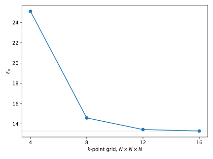

######################
 Dielectric constants
######################

A Koopmans calculation on a solid needs the material's macroscopic dielectric constant,
:math:`\varepsilon_\infty`. In a charged periodic supercell — the setting for
:doc:`screening parameters from total-energy differences <../band_structures/silicon_finite_differences/index>`
— the added or removed charge interacts with its own periodic images, and the
Makov-Payne correction that removes this spurious interaction needs
:math:`\varepsilon_\infty` to scale the leading-order term. Get it wrong and the
correction is wrong, along with everything downstream of it.

This tutorial computes :math:`\varepsilon_\infty` for bulk silicon with density-functional
perturbation theory (DFPT) :cite:`Baroni2001`, using the ``dft_eps`` task.

****************
 The input file
****************

Download :download:`si_eps.yaml <si_eps.yaml>` and place it in an empty directory. Here it
is in full:

.. literalinclude:: si_eps.yaml
    :language: yaml

.. literalinclude:: si_eps.yaml
    :language: yaml
    :start-at: task
    :end-at: task

runs one ``pw.x`` self-consistent calculation, then ``ph.x`` with ``epsil = .true.`` and
``trans = .false.`` at :math:`q = \Gamma`: the electric-field response, without the
phonon calculation ``ph.x`` would otherwise also do.

.. literalinclude:: si_eps.yaml
    :language: yaml
    :start-at: kpoints:
    :end-at: grid:

sets the Brillouin-zone sampling for both steps. Unlike a Wannierization or a
:math:`\Delta`SCF screening calculation, ``dft_eps`` builds no supercell — the whole
calculation runs in the primitive cell, so ``grid`` is the actual cost knob.

Run it with

.. code-block:: console

    $ koopmans run si_eps.yaml

*************
 The outputs
*************

The run produces the same two-step tree as any other DFT calculation, ``si_eps/01-scf``
and ``si_eps/02-ph``, plus a top-level ``si_eps/outputs`` collecting the results that
matter beyond either individual step:

.. code-block:: text

    si_eps/
    ├── 01-scf/
    ├── 02-ph/
    └── outputs/
        ├── dielectric_tensor.json
        ├── eps_inf.json
        └── ph_output_parameters.json

``dielectric_tensor.json`` is ph.x's :math:`3 \times 3` dielectric tensor; for cubic
silicon it is already isotropic. ``eps_inf.json`` is the single number a Koopmans
calculation wants: the isotropic average of that tensor.

.. question:: What dielectric constant do you get?

    25.10, read from ``si_eps/outputs/eps_inf.json``.

*************************
 Convergence with k-grid
*************************

25.10 is a long way from converged. :math:`\varepsilon_\infty` is a Brillouin-zone
integral over the whole occupied-to-empty response, and it needs a much denser mesh than
a ground-state total energy to converge:

.. list-table::
    :header-rows: 1

    * - :math:`k`-point grid
      - :math:`\varepsilon_\infty`
    * - :math:`4\times4\times4`
      - 25.10
    * - :math:`8\times8\times8`
      - 14.59
    * - :math:`12\times12\times12`
      - 13.45
    * - :math:`16\times16\times16`
      - 13.30

The :math:`4\times4\times4` grid this tutorial ran gives a value nearly twice the
:math:`16\times16\times16` one. The mesh that converges :math:`\varepsilon_\infty`
is unrelated to any other :math:`k`-point grid in the workflow — a Koopmans
calculation converged in every other respect can still carry a badly wrong
Makov-Payne correction if this grid was never checked on its own.

.. question:: Change ``kpoints.grid`` to ``[8, 8, 8]`` and rerun. How much closer does
    the answer get?

    14.59, against 13.30 at :math:`16\times16\times16` and 13.45 at
    :math:`12\times12\times12`: one doubling of the grid recovers most of the remaining
    error, but not all of it. Cost grows fast alongside it — this run's ``ph.x`` step
    took about three times as long as the :math:`4\times4\times4` one.

****************
 Feeding it in
****************

Set the converged value as ``eps_inf`` in the ``workflow`` block of a ``singlepoint``
input:

.. code-block:: yaml

    workflow:
      task: singlepoint
      eps_inf: 13.30

For a ``screening_method: dfpt`` run, ``eps_inf: auto`` is also accepted: the same
scf-then-``ph.x`` calculation this tutorial just ran becomes the workflow's own first
step, and its result is used in place of a number you supply. ``screening_method: dscf``
does not yet accept ``auto`` — give it a number, computed as above.

.. note::

    LDA systematically overestimates :math:`\varepsilon_\infty` relative to experiment
    — silicon's measured value is about 11.7, well below every grid in the table above.
    This is a known shortcoming of the underlying exchange-correlation functional, not a
    convergence problem, and it is not something a denser :math:`k`-point grid fixes.
