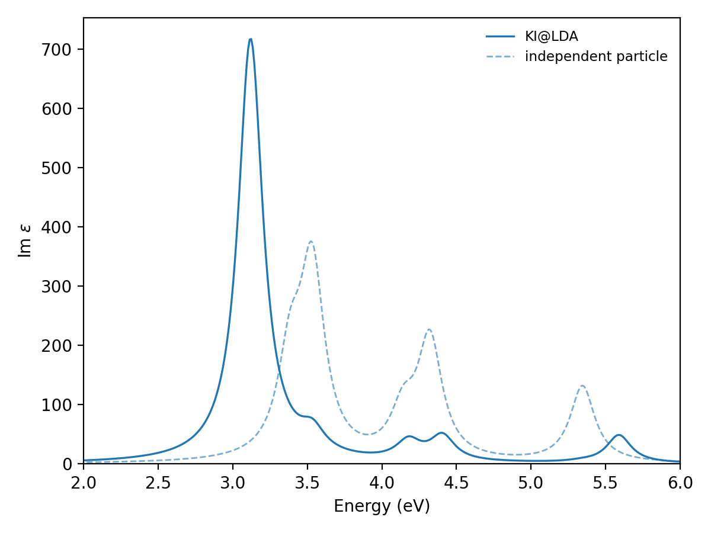

##################################################################
 Optical absorption of silicon, from the Bethe-Salpeter equation
##################################################################

This tutorial computes the optical absorption spectrum of bulk silicon with the
Bethe-Salpeter equation (BSE), on top of quasiparticle energies from a Koopmans
calculation. It assumes you already know how a periodic Koopmans calculation is built
from Wannier functions, taught in the :doc:`finite-differences tutorial
<../../band_structures/silicon_finite_differences/index>`. The screening parameters
here come from density-functional perturbation theory instead of total-energy
differences — the same linear-response route as the :doc:`sibling tutorial
<../../band_structures/silicon_linear_response/index>` — computed in the primitive
cell rather than a supercell, and this tutorial feeds the resulting quasiparticle
energies into `yambo <http://www.yambo-code.org/>`_.

**************************************
 What the Bethe-Salpeter equation adds
**************************************

The simplest way to compute an absorption spectrum is to promote an electron from an
occupied band to an empty one and add up every such transition allowed by the light's
polarization — the independent-particle approximation. It ignores that the promoted
electron and the hole it leaves behind are charged particles that attract one another.
The Bethe-Salpeter equation adds that electron-hole interaction back in, on top of a
screened Coulomb kernel, and diagonalizes the resulting two-particle Hamiltonian. Two
things change: transitions close in energy mix into new combinations (some brighter,
some dimmer than any single transition alone), and bound electron-hole pairs — excitons
— can appear below the lowest unbound transition, red-shifting the spectrum's onset.

The single-particle energies that go into either calculation matter as much as the
kernel: an absorption spectrum built from bare DFT eigenvalues inherits DFT's
underestimated gap, shifting the whole spectrum to the wrong energy before the
electron-hole interaction ever enters. yambo BSE calculations usually source their
input quasiparticle energies from a GW calculation, but this route sources them from a
Koopmans calculation instead, at a fraction of the cost.

***************
 Prerequisites
***************

.. warning::

    Everything up to and including the linear-response tutorial installs with
    ``koopmans install``. This tutorial also needs yambo, which does not:
    register ``p2y`` and ``yambo`` as AiiDA codes yourself, e.g. with ``verdi code
    create core.code.installed``, and install the ``k2y`` and ``aiida-yambo``
    packages that give ``koopmans`` a way to drive them.

The ``bse`` task composes the DFPT chain from the previous tutorial with a fresh yambo
run, so every restriction that route documents applies here too, plus a few of its own
that the code checks before submitting anything:

- ``workflow.screening_method`` must be ``dfpt``: the BSE route seeds yambo's
  quasiparticle database from a kcw.x ``ham`` run's eigenvalues, which only DFPT
  screening produces.
- ``workflow.spin`` must be ``none``: the composed workflow reads a single DFPT
  channel, and a collinear or spinor run has none.
- ``kpoints.path`` is rejected outright: the composed DFPT step runs no band-structure
  interpolation, and yambo reports an exciton spectrum, not a band structure.
- ``calculator_parameters.yambo.BSEBands`` must not reach past the Wannierized
  manifold: a Koopmans quasiparticle correction exists only for the bands the DFPT
  chain Wannierizes.

****************
 The input file
****************

Download :download:`si-bse.yaml <si-bse.yaml>` and place it in an empty directory. Here
it is in full:

.. literalinclude:: si-bse.yaml
    :language: yaml

Most of this you have seen before: the ``atoms``, ``kpoints`` and ``wannier90``
projections are identical to the linear-response tutorial's silicon input, and
``workflow.task`` is the only new keyword in that block.

The new block is ``calculator_parameters.yambo``, which sets yambo's own runcard
variables under their own names:

.. literalinclude:: si-bse.yaml
    :language: yaml
    :start-at: yambo:
    :end-before: parallelization:

``BndsRnXs`` and ``NGsBlkXs`` converge the static screening, the same way a plane-wave
cutoff converges a DFT total energy: more bands and a larger G-vector cutoff bring the
screened Coulomb interaction closer to its exact value. ``BSEBands`` says which bands
enter the two-particle kernel — here the whole 8-band manifold the DFPT chain
Wannierizes, since that is where the Koopmans corrections exist. ``BEnRange`` and
``BEnSteps`` set the energy window and resolution of the spectrum, and ``BDmRange`` an
artificial linewidth that turns a stick spectrum of discrete transitions into a smooth
curve. ``LongDrXs`` and ``BLongDir`` fix the light's polarization, for the screening
and the BSE spectrum respectively.

.. warning::

    ``BSEBands`` narrower than the full manifold can cut a pair of degenerate bands
    apart at some k-point on the mesh, which yambo refuses with "User bands ... break
    level degeneracy". Widening ``BSEBands`` back to the full manifold is the fix; this
    is why the input file above uses ``[1, 8]`` rather than a smaller window.

.. tip::

    ``yambo`` cannot always split its ranks across the calculation on its own. On this
    small system, running the BSE step on 4 MPI ranks with no split fails with
    "Impossible to define an appropriate parallel structure"; the ``bethe_salpeter``
    role split in the input file above fixes this. Each driver's role counts must
    multiply to that driver's ``ntasks``, and a role count is capped by what the system
    actually has of it — here ``k: 2`` is already at the limit, since silicon's
    :math:`2\times2\times2` mesh reduces to only 3 irreducible k-points.

*************
 Running it
*************

.. code-block:: console

    $ koopmans run si-bse.yaml

The progress table walks through the same DFPT chain as the linear-response tutorial —
scf, nscf, a Wannierization per manifold, then wann2kc, screen and ham — followed by a
fresh yambo chain: an scf and nscf for yambo's own ground state, ``p2y`` to build its
SAVE directory, a step that turns the DFPT chain's kcw.x eigenvalues into yambo's own
quasiparticle database, and finally the BSE calculation itself.

.. question:: Where does the Koopmans correction enter the yambo calculation?

    At the step named "Quasiparticle database". ``koopmans`` reads the ``ham`` step's
    Koopmans eigenvalues and writes them into a yambo ``ndb.QP`` database, in place of
    the GW quasiparticle database a BSE calculation more commonly reads. Every later
    step treats it exactly as it would a GW correction.

*******************************
 The quasiparticle correction
*******************************

yambo's own report on the BSE step states the gap before and after applying that
database. Uncorrected, the :math:`2\times2\times2` grid's indirect gap is 0.62 eV.
With the Koopmans correction applied it opens to 1.39 eV: a 0.77 eV correction, the
same qualitative repair of an underestimated DFT gap you saw with a different
screening method in the finite-differences tutorial.

.. question:: What is the smallest *direct* transition, and where does it sit?

    3.38 eV, at :math:`\Gamma`. Optical absorption near the fundamental gap is governed
    by direct transitions, since the light does not deliver enough momentum to bridge
    an indirect gap the way a phonon can. This 3.38 eV is what the rest of this
    tutorial compares the exciton spectrum against.

**********************
 The optical spectrum
**********************

.. code-block:: console

    $ koopmans plot spectrum si-bse --label "KI@LDA" --xlim 2 6 -o spectrum.png

This draws the imaginary part of the dielectric function against energy, with the
run's independent-particle spectrum overlaid as a dashed curve for comparison:

.. question:: Compare the two curves. What does the electron-hole interaction do to
    the spectrum?

    It red-shifts the main peak from 3.52 eV (independent particle) to 3.12 eV, and
    roughly doubles its height. Both are the signature of an exciton: the bound
    electron-hole pair sits below the 3.38 eV direct transition it is built from, and
    pulls the oscillator strength of nearby transitions into itself as it forms.

.. question:: What is the exciton's binding energy?

    3.38 eV (the direct transition) minus 3.12 eV (the lowest exciton) is 0.27 eV. Take
    this as illustrative rather than converged: a :math:`2\times2\times2` grid samples
    the electron-hole pair's relative motion far too coarsely for the binding energy
    itself to be trustworthy, even though the qualitative red shift is robust.

.. note::

    As a check that this shift is a quasiparticle-energy effect and not an artifact of
    the electron-hole kernel: restricting the calculation to just the 4→5 transition at
    :math:`\Gamma` and turning the Koopmans correction off moves that single exciton to
    2.57 eV; turning the correction back on moves it to 3.48 eV. That roughly 0.9 eV
    shift is the same size as the 0.77 eV the correction opened the fundamental gap by
    above — the spectrum moves because the input quasiparticle energies moved, not
    because the kernel changed.

*********
 Up next
*********

Two things were left coarse in this tutorial. The :math:`2\times2\times2` k-point grid
is far too sparse to converge an exciton binding energy, and ``BndsRnXs``/``NGsBlkXs``
were not converged against the spectrum the way you would converge a plane-wave cutoff
against a total energy. Both cost a great deal more to refine here than in a plain DFT
calculation, for the same reason the earlier silicon tutorials warn about the
Brillouin-zone sampling: a denser grid means a larger Wannierized manifold to screen
and a larger yambo calculation to run on top of it.
