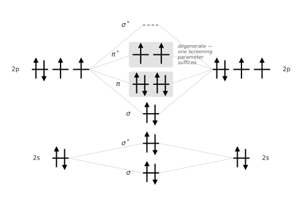

##########################
 Spin-polarized molecules
##########################

Ozone, the molecule we considered in the :doc:`previous exercise<../ozone/automatically>`,
is closed-shell, with pairs of spin-up and spin-down electrons occupying the same
molecular orbitals. However, not all molecules are closed-shell:
the oxygen molecule's ground state is a spin triplet. In DFT, this is typically
treated as a spin-symmetry broken calculation with two more spin-up electrons than
spin-down electrons.

    Schematic molecular-orbital diagram of O₂; the two unpaired electrons in the
    degenerate :math:`\pi^*` orbitals make the ground state a spin triplet.

Handling a spin-polarized system changes what a Koopmans calculation
must do — every orbital now carries a spin channel as well as an index, and the screening
parameters also become spin-dependent.

.. question:: Before continuing, try to adapt the
    :download:`ozone.yaml<../ozone/ozone.yaml>` input file to molecular oxygen.
    O₂ has a bond length of 1.21 Å. Explore the
    :doc:`input file documentation<../../../input_schema>` for more details
    about valid inputs.

    Set ``spin: collinear`` in the ``workflow`` block, add ``tot_magnetization: 2`` and
    lower ``nbnd`` to ``8`` in ``calculator_parameters``, and update the atomic positions.

****************
 The input file
****************

Download :download:`o2.yaml <o2.yaml>` — the ozone input with those changes made,
plus one optional addition explained below — and place it in an empty directory:

.. literalinclude:: o2.yaml
    :language: yaml

.. warning::

    As in the ozone tutorial, the cell and the cutoff here are rough enough to finish in
    minutes, and are not converged. Don't use these settings for publication-quality results!

Three settings make this an open-shell calculation.

.. literalinclude:: o2.yaml
    :language: yaml
    :start-at: spin
    :end-at: spin

gives the two channels their own orbitals, their own eigenvalues and their own screening
parameters.

.. literalinclude:: o2.yaml
    :language: yaml
    :start-at: tot_magnetization
    :end-at: tot_magnetization

fixes how the electrons divide between them. O₂ has 12 valence electrons, so a
magnetization of 2 puts 7 in the majority channel and 5 in the minority.

.. literalinclude:: o2.yaml
    :language: yaml
    :start-at: nbnd
    :end-at: nbnd

counts bands *per channel*, not in total: 7 filled and 1 empty in the majority channel,
5 filled and 3 empty in the minority. That is 16 orbitals that need
screening parameters, against ozone's 10.

One further setting is not about spin, but changes what you will see. ``group_orbitals_by:
self_hartree`` lets orbitals whose self-Hartree energies agree to within
``group_orbitals_tol`` share a screening parameter: one member of each group is screened
and the rest inherit the result. Orbitals of different spin or occupation are never grouped
together. This should make our calculation faster, because, as we know from the molecular
orbital diagram above, we will have sets of degenerate molecular orbitals.

*************************
 What changes in the run
*************************

Run it as before:

.. code-block:: console

    $ koopmans run o2.yaml

The progress table differs from ozone's in three places.

The initialization is a single step, ``DFT initialization``, rather than the three-step
detour through a spin-unpolarized calculation. That detour exists to hand the
spin-resolved calculation an already-symmetric density; here the two channels are
*meant* to differ, so there is nothing to symmetrize and the workflow starts
spin-resolved from scratch.

The per-orbital screening steps now name a channel as well as an index — ``Orbital 1
(spin down)`` through ``Orbital 8 (spin up)`` — and there is one step per group rather
than one per orbital, so some indices never appear.

The empty orbitals (6 and 8 in the minority channel, 8 in the majority) each expand into
three sub-steps — ``DFT (N+1, staging)``, ``PZ staging`` and ``DFT (N+1)`` — because
screening an empty orbital means adding an electron to it, and that :math:`N+1` state
needs staging before it can be converged. A filled orbital needs a single
:math:`N-1` calculation.

*************
 The results
*************

.. question:: Find the screening parameters the final calculation used. Are they what
    you expect from the molecular-orbital diagram?

    They are in the final calculation's inputs: ``o2/04-RunFinalKI/inputs/file_alpharef.txt``
    for the filled orbitals (the majority channel's seven, then
    the minority channel's five) and ``file_alpharef_empty.txt`` for the empty ones.
    For closed-shell ozone the workflow computes one list and writes it into both
    channels; here the two are computed independently.

    .. code-block:: text

        12
        1 0.70188355454189 1.0
        2 0.77998780115646 1.0
        3 0.77018447734046 1.0
        4 0.77915791683383 1.0
        5 0.77915791683383 1.0
        6 0.78324714854684 1.0
        7 0.78324714854684 1.0
        8 0.68958599360713 1.0
        9 0.77418372283912 1.0
        10 0.7675286300012 1.0
        11 0.76365229983711 1.0
        12 0.76365229983711 1.0

    and ``file_alpharef_empty.txt`` (the majority channel's one empty orbital, then the
    minority channel's three):

    .. code-block:: text

        4
        1 0.99335676923574 1.0
        2 0.57933221985214 1.0
        3 0.57933221985214 1.0
        4 0.99555552922404 1.0

    The degenerate pairs are visible as repeated values — orbitals 4/5 and 6/7 in the
    majority channel (the :math:`\pi` and :math:`\pi^*` pairs), 11/12 among the filled
    minority orbitals and 2/3 among the empty ones — and those are exactly the orbitals
    the progress table skipped: one member of each group was screened and the other
    inherited its parameter. The empty :math:`\pi^*` pair in the minority channel is
    screened much more weakly (0.58) than the filled orbitals (0.70–0.78): adding an
    electron to O₂ is a different physical process from removing one.

.. question:: What are the ionization potential and electron affinity, and how do they
    compare with experiment?

    The final KI output, ``o2/04-RunFinalKI/outputs/aiida.cpo``, reports ``Eigenvalues``
    for ``spin = 1`` and ``spin = 2`` separately, and a single ``HOMO Eigenvalue`` and
    ``LUMO Eigenvalue`` across both:

    .. code-block:: text

        HOMO Eigenvalue (eV)

       -12.3530

        LUMO Eigenvalue (eV)

        -0.4034

        Eigenvalues (eV), kp =   1 , spin =  1

       -40.4134  -26.9181  -19.3373  -19.3373  -19.2188  -12.3530  -12.3530

        Empty States Eigenvalues (eV), kp =   1 , spin =  1

         0.2789

        Eigenvalues (eV), kp =   1 , spin =  2

       -39.0858  -24.8438  -18.1808  -16.9070  -16.9070

        Empty States Eigenvalues (eV), kp =   1 , spin =  2

        -0.4034   -0.4004    0.2402

    The majority channel fills both :math:`\pi^*` orbitals and the minority leaves them
    empty, so the highest occupied and lowest unoccupied orbitals are the same orbital in
    opposite channels, each screened by a parameter of its own.

    KI puts the ionization potential at 12.35 eV and the electron affinity at 0.40 eV.
    As in the ozone tutorial, an orbital energy is a vertical (cf. adiabatic) energy.
    O₂'s vertical first ionization is between 12.30 eV :cite:`Kimura1981` and 12.33 eV
    :cite:`Banna1976`. The electron affinity has no measured vertical counterpart: it is
    usually measured by photodetachment on O₂⁻, whose bond is much longer than O₂'s.
