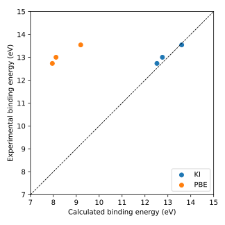

##############################
Doing everything automatically
##############################

The :doc:`previous part <manually>` computed one screening parameter via three
calculations run by hand. This part computes one for every orbital of the same molecule,
and both the ionization potential and the electron affinity that follow from them, in a
single command.

****************
 The input file
****************

Download :download:`ozone.yaml <ozone.yaml>` and place it in an empty directory. Here it
is in full:

.. literalinclude:: ozone.yaml
    :language: yaml

.. warning::

    The cell and cutoffs in this file are deliberately rough, so that the whole workflow
    finishes in minutes. They are not converged! Use this file to learn the input
    format, not as something to copy-paste for production work.

The ``workflow`` block describes the workflow that will be run.

.. literalinclude:: ozone.yaml
    :language: yaml
    :start-at: screening_method
    :end-at: screening_method

selects the procedure you carried out by hand: constrained calculations at :math:`N`,
:math:`N-1` or :math:`N+1` electrons, whose energy differences are compared against the
orbital energies (see :doc:`the theory page <../../../theory>`).

.. literalinclude:: ozone.yaml
    :language: yaml
    :start-at: init_orbitals
    :end-at: init_orbitals

uses the Kohn-Sham orbitals as the variational orbitals — what the hand copies of the
``.dat`` files achieved in the previous part. This is common practice for molecules;
periodic systems use Wannier functions instead.

.. literalinclude:: ozone.yaml
    :language: yaml
    :start-at: alpha_numsteps
    :end-at: alpha_numsteps

computes the screening parameters once, from a guess, and uses them. Increasing this
number will refine them self-consistently.

.. literalinclude:: ozone.yaml
    :language: yaml
    :start-at: pseudo_library
    :end-at: pseudo_library

determines that PBE will be the base functional that the KI correction is applied on top
of.

The ``atoms`` block describes the cell and the atoms in it, much like a ``Quantum ESPRESSO``
input file. The positions are Cartesian, in the units the block declares.

.. question:: Why is the simulation cell so much larger than the molecule itself?

    The cell is a box of vacuum that keeps the molecule's periodic images apart (a
    plane-wave code works in a supercell even when the system is treated as
    non-periodic). Vacuum padding matters more here than in a ground-state calculation,
    because the screening calculations give the molecule a net charge and charged images
    interact via a long-ranged Coulomb tail. To compensate for this, the code will also
    apply a counter-charge correction that compensates the residual interaction between
    images, and these corrections have less to do the further apart the images are.

The ``calculator_parameters`` block holds other calculator settings.

.. literalinclude:: ozone.yaml
    :language: yaml
    :start-at: nbnd
    :end-at: nbnd

adds one empty orbital to the nine that ozone's 18 valence electrons fill, which we need
because the electron affinity is the energy of the LUMO. In later tutorials we will go into
more detail on how to specify code-specific parameters.

*************************
 Running the calculation
*************************

.. warning::

    Make sure you have installed ``koopmans``: see :doc:`here <../../../installation>` for more details.

    Of all the ``Quantum ESPRESSO`` codes, this workflow only needs ``kcp.x``.

Run the calculation with

.. code-block:: console

    $ koopmans run ozone.yaml

The terminal shows a live progress table that grows as the workflow proceeds. At the end
it reads

.. code-block:: text

     Step                                                                      Status
     Koopmans DSCF Workflow                                                  finished
       DFT Init (nspin=1)                                                    finished
       DFT Init (nspin=2; dummy)                                             finished
       DFT Init (nspin=2)                                                    finished
       Compute Screening Parameters                                          finished
         Iteration 1                                                         finished
           KI Trial                                                          finished
           Compute Orbital Screening Parameters                              finished
             Compute Alpha Orb 1                                             finished
               DFT N-1                                                       finished
             Compute Alpha Orb 2                                             finished
               DFT N-1                                                       finished
             ...
             Compute Alpha Orb 9                                             finished
               DFT N-1                                                       finished
             Compute Alpha Orb 10                                            finished
               DFT N+1 Dummy                                                 finished
               PZ Print                                                      finished
               DFT N+1                                                       finished
       Run Final KI                                                          finished
         KI Final                                                            finished

    Workflow completed successfully!

Reading it top to bottom, we can identify three stages of the workflow:

-------------------------------
 Initialization (``DFT Init``)
-------------------------------

This is the PBE calculation you ran first by hand, with one wrinkle: it takes three steps
rather than one. Adding and removing single electrons later on requires a spin-resolved
description, so the workflow must end up at a spin-resolved calculation — but it gets
there via a detour, running a spin-unpolarized calculation, then a dummy spin-resolved
one that lays out the restart files, and finally a spin-resolved calculation that
restarts from the spin-unpolarized density duplicated into both spin channels.

.. question:: Why the detour, instead of one spin-resolved calculation from scratch?

    For ozone — a closed-shell molecule — a direct spin-resolved calculation would in
    fact converge to the correct spin-symmetric solution. The detour has two virtues
    all the same. In harder systems, a spin-resolved calculation started from scratch
    can collapse into a spurious broken-symmetry solution with
    :math:`n^\uparrow(\mathbf{r}) \neq n^\downarrow(\mathbf{r})`; handing it an
    already-converged symmetric density avoids that. And it is cheaper: most of the
    self-consistency cycles happen in the spin-unpolarized problem, which has half
    the wavefunctions.

From this point on the density never changes: KI, by construction, returns the same
density as its base functional. (This is not true of KIPZ.)

---------------------------------------------------------
 Screening parameters (``Compute Screening Parameters``)
---------------------------------------------------------

This is the bulk of the calculation, and it is the trial-KI-and-constrained-DFT pair from
the previous part, repeated for every orbital instead of just the HOMO:

- the ``KI trial`` step plays the role of your trial run, with the guess
  :math:`\alpha_i = 0.6` in place of 0.7 and every orbital's energy recorded rather than
  the HOMO's alone;
- then, for each of the nine filled orbitals in turn, a constrained :math:`N-1`
  calculation like the one you ran, with ``fixed_band`` pointing at that orbital;
- the one empty orbital runs the procedure in reverse — two preparatory calculations
  followed by an :math:`N+1`-electron constrained calculation in which the orbital is
  filled, giving :math:`E_i(N+1)`.

Each orbital's screening parameter then comes from the formula you derived, applied to
that orbital's own energies. With ``alpha_numsteps: 1``, the loop stops there.

------------------------------------------
 The final calculation (``Run Final KI``)
------------------------------------------

Your ``ozone_ki_opt.in`` run, with ten different screening parameters in place of one
applied universally. The orbital energies it prints are the spectral properties we are
after.

*************
 The outputs
*************

The results land in a directory named after the input file — here ``ozone/`` — laid out
to mirror the workflow outline above:

.. code-block:: text

    ozone
    ├── 01-count_electrons_task
    │   └── inputs
    ├── 02-dft_init_nspin1
    │   ├── inputs
    │   └── outputs
    ├── 03-dft_init_nspin2_dummy
    │   ├── inputs
    │   └── outputs
    ├── 04-dft_init_nspin2
    │   ├── inputs
    │   └── outputs
    ├── 05-ComputeScreeningParameters
    │   └── 01-ScreeningIteration
    │       ├── 01-ki_trial
    │       │   ├── inputs
    │       │   └── outputs
    │       └── 02-compute_orbital_screening_parameters
    │           ├── 01-compute_alpha_orb_1
    │           │   ├── 01-dft_n_minus_1
    │           │   └── 02-compute_alpha_from_dscf
    │           ├── ...
    │           └── 10-compute_alpha_orb_10
    │               ├── 01-dft_n_plus_1_dummy
    │               ├── 02-pz_print
    │               ├── 03-dft_n_plus_1
    │               └── 04-compute_alpha_from_dscf
    ├── 06-RunFinalKI
    │   ├── inputs
    │   └── outputs
    └── README

One directory per step, numbered in the order the steps ran. A step that is a Quantum
ESPRESSO calculation holds the exact input file the engine generated (``aiida.cpi``)
plus its pseudopotentials in ``inputs/``, and everything the calculation wrote
(``aiida.cpo`` and more) in ``outputs/``.

.. note::

    The engine also keeps its own complete record of every calculation in its database —
    that is how an interrupted workflow resumes where it left off, and how a repeated
    calculation is served from cache instead of running twice. The ``ozone/`` directory
    is a plain-file export of that record for you to read.

**************************
 Interpreting the results
**************************

You read the ionization potential off a ``kcp.x`` output once already; this time the
electron affinity comes with it, as the negative of the LUMO energy. Open
``ozone/06-RunFinalKI/outputs/aiida.cpo`` and search near the bottom for the ``HOMO
Eigenvalue`` and ``LUMO Eigenvalue`` lines — and, for the PBE comparison, find the same
lines in the initialization output, ``ozone/04-dft_init_nspin2/outputs/aiida.cpo``.

.. question:: What do you find?

    Near the bottom of the final KI output:

    .. code-block:: text

        HOMO Eigenvalue (eV)

        -12.4945

        LUMO Eigenvalue (eV)

        -1.7184

        Electronic Gap (eV) =    10.7761

        Eigenvalues (eV), kp =   1 , spin =  1

        -40.3490  -33.0412  -24.3772  -19.7139  -19.5385  -19.2977  -13.5960  -12.7467  -12.4945

        Empty States Eigenvalues (eV), kp =   1 , spin =  1

        -1.7184

    The initialization output puts the PBE HOMO at −7.9229 eV and the PBE LUMO at
    −6.1058 eV.

KI puts the ionization potential at 12.49 eV and the electron affinity at 1.72 eV,
where PBE would have given 7.92 eV and 6.11 eV. This is the same 12.49 eV the
:doc:`previous part <manually>` arrived at by hand, as it should be: the screening
parameter computed there enforces the same Koopmans condition on the same orbital.

An orbital energy is a *vertical* removal energy — the geometry does not relax with the
electron — so the measurement to compare against is vertical photoemission, which puts
ozone's first ionization at 12.73 eV :cite:`Wiesner2003`. KI is a quarter of an
electronvolt below that; PBE is nearly five below. The `measured electron affinity
<https://webbook.nist.gov/cgi/cbook.cgi?ID=C10028156&Mask=20#Ion-Energetics>`_ is 2.10
eV, which KI undershoots by 0.4 eV and PBE overshoots by four.

.. note::

    Tables of ozone's properties usually quote an `ionization energy
    <https://webbook.nist.gov/cgi/cbook.cgi?ID=C10028156&Mask=20#Ion-Energetics>`_ of
    12.52 eV. That is the *adiabatic* value, which lets the ion relax into its own
    geometry and so comes out lower. Orbital energies correspond to vertical ones.

Photoemission resolves more than the frontier orbital, and KI predicts a binding energy
for every occupied one. The three outermost are cleanly assigned — 12.73, 13.00 and
13.54 eV :cite:`Wiesner2003` — while the deeper assignments are less certain, so they
are left out. The three KI values sit at the end of the final KI output's
``Eigenvalues`` line, and the PBE ones in the corresponding line of the initialization
output. Plotting one against the other:

    Calculated against experimental binding energies for the three outermost occupied
    orbitals of ozone, from this run; a point on the dashed line agrees perfectly with
    experiment. Made by :download:`plot_ozone_spectrum.py <plot_ozone_spectrum.py>`,
    which reads the two ``Eigenvalues`` lines out of the ``ozone/`` directory.

KI lands within about a quarter of an electronvolt of experiment for all three orbitals;
PBE misses by more than four.

The screening parameters behind this result are recorded in the final calculation's
input: ``ozone/06-RunFinalKI/inputs/file_alpharef.txt`` lists one :math:`\alpha_i` per
orbital, here ranging from 0.66 to 0.79 — each one computed, not fitted.

.. question:: Why one screening parameter per orbital, rather than the single α of the previous part?

    The single :math:`\alpha` you computed enforces the Koopmans condition on the HOMO
    alone — which is why the ionization potential came out right there, and why nothing
    else did. In particular the electron affinity suffers, because an :math:`\alpha`
    tuned for the HOMO cannot simultaneously describe the LUMO. Screening is an
    orbital-by-orbital affair.

.. question:: What happens if you increase ``alpha_numsteps`` to 2 and rerun?

    With ``alpha_numsteps: 1`` the screening parameters are computed once from the
    starting guess and never checked for self-consistency. With a second step, the
    workflow repeats the screening loop starting from the just-computed parameters
    instead of 0.6, and only updates a parameter further if its residual is above the
    convergence threshold (``alpha_conv_thr``). You should find that the parameters
    barely move — the first pass already brought them close to self-consistency.

*************
 From python
*************

The same calculation runs from python, which is the easier route for sweeping a
parameter or working in a notebook. Reading the input file and running it are a line
each, and the results come back as a dict instead of as output files to search:

.. code-block:: python

    from koopmans import read_input_file, run

    results = run(read_input_file("ozone.yaml"))

    homo = results["parameters"]["homo_energy"]
    lumo = results["parameters"]["lumo_energy"]

    print(f"IP = {-homo:.2f} eV")  # IP = 12.49 eV
    print(f"EA = {-lumo:.2f} eV")  # EA = 1.72 eV

Energies are in eV, and the ionization potential and electron affinity are the negated
HOMO and LUMO energies as before — the same two numbers read out of ``aiida.cpo`` above.
``results`` carries the rest of the final calculation's outputs alongside them,
``eigenvalues`` among them.

``run`` blocks python until the workflow finishes. For a calculation long enough that
this is inconvenient, the alternative is ``submit``, which returns an integer ID
immediately and leaves the workflow running in the background. Later, use
``outputs(<ID>)`` to read the finished result. See :doc:`../../../api` for more detail.
