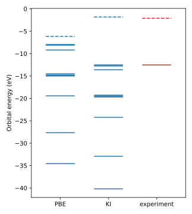

#########################################################
 The ionization potential and electron affinity of ozone
#########################################################

This tutorial calculates the ionization potential and electron affinity of the ozone
molecule with the KI functional. Both are quantities a photoemission experiment measures
directly — the energy to remove an electron from the highest occupied molecular orbital
(HOMO), and the energy gained by adding one to the lowest unoccupied molecular orbital
(LUMO) — and both are quantities that ordinary density-functional theory gets badly
wrong. A Koopmans calculation reads them off the orbital energies of the corrected
functional, with screening parameters computed from first principles rather than
guessed. This is the first tutorial where those screening parameters appear, so along
the way it explains what they are and why most of the calculation is spent computing
them.

****************
 The input file
****************

Download :download:`ozone.json <ozone.json>` and place it in an empty directory. Here it
is in full:

.. literalinclude:: ozone.json
    :language: json

The ``workflow`` block chooses what kind of calculation to run:

- ``"task": "singlepoint"`` computes the spectral properties of the system at fixed
  geometry — the standard task, and the one every tutorial so far uses.
- ``"correction": "ki"`` selects the KI flavor of the Koopmans correction (as opposed to
  KIPZ).
- ``"screening_method": "dscf"`` computes the screening parameters from total-energy
  differences: for each orbital, the code performs constrained calculations with
  :math:`N`, :math:`N-1`, or :math:`N+1` electrons and compares the resulting energy
  differences against the orbital energies (see :doc:`the theory page <../theory>`).
- ``"init_orbitals": "kohn-sham"`` uses the Kohn-Sham orbitals of the base functional as
  the variational orbitals that the correction acts on. This is common practice for
  molecules; periodic systems use Wannier functions instead.
- ``"alpha_numsteps": 1`` performs a single pass of the screening-parameter loop:
  compute the screening parameters once, starting from a guess, and use them. More steps
  refine them self-consistently.
- ``"pseudo_library"`` selects the pseudopotential family — here SG15 version 1.2,
  scalar-relativistic, generated with PBE. This also fixes PBE as the base functional
  that the KI correction is applied on top of.

The ``atoms`` block describes the cell and the atoms in it, much like a Quantum ESPRESSO
input file (albeit in JSON):

- ``cell_parameters`` gives the three cell vectors; ``"periodic": false`` declares the
  system to be an isolated molecule, so the cell is just a large box that keeps the
  molecule's periodic images apart.
- ``atomic_positions`` lists each atom and its Cartesian position in the chosen units.

The ``calculator_parameters`` block holds the plane-wave settings:

- ``ecutwfc`` is the wavefunction cutoff in Ry.
- ``nbnd`` is the number of orbitals. Ozone has 18 valence electrons and therefore nine
  filled orbitals; ``"nbnd": 10`` adds one empty orbital, which we need because the
  electron affinity is the energy of the LUMO.
- ``kcp.system.ecutrho`` is the charge-density cutoff in Ry, passed straight through to
  ``kcp.x``, the Quantum ESPRESSO code that evaluates the corrected functional. Keywords
  that ``koopmans`` does not define itself can be handed to the underlying codes this
  way.

*************************
 Running the calculation
*************************

Make sure you have :doc:`installed the engine <../installation>` (``koopmans install``;
this workflow needs ``pw.x`` and ``kcp.x``), then run

.. code-block:: console

    $ koopmans run ozone.json

The terminal shows a live progress table that grows as the workflow proceeds. At the end
it reads

.. code-block:: text

     Step                                                                      Status
     Koopmans DSCF Workflow                                                  finished
       DFT Init (nspin=1)                                                    finished
       DFT Init (nspin=2; dummy)                                             finished
       DFT Init (nspin=2)                                                    finished
       Compute Screening Parameters                                          finished
         Iteration 1                                                         finished
           KI Trial                                                          finished
           Compute Orbital Screening Parameters                              finished
             Compute Alpha Orb 1                                             finished
               DFT N-1                                                       finished
             Compute Alpha Orb 10                                            finished
               DFT N+1 Dummy                                                 finished
               PZ Print                                                      finished
               DFT N+1                                                       finished
             Compute Alpha Orb 2                                             finished
               DFT N-1                                                       finished
             ...
             Compute Alpha Orb 9                                             finished
               DFT N-1                                                       finished
       Run Final KI                                                          finished
         KI Final                                                            finished

    Workflow completed successfully!

Reading it top to bottom:

**Initialization.** The first three steps initialize the electron density and the
variational orbitals with PBE. Why three calculations and not one? The screening
calculations later on add and remove single electrons, which requires a spin-resolved
description — but ozone is a closed-shell molecule, and a plain spin-resolved PBE
calculation risks falling into a spin-contaminated local minimum where
:math:`n^\uparrow(\mathbf{r}) \neq n^\downarrow(\mathbf{r})`. So the workflow first
converges the density with the two spin channels constrained to be identical, and only
then lifts the restriction: a spin-unpolarized calculation, a dummy spin-resolved
calculation that lays out the restart files, and a final spin-resolved calculation that
restarts from the spin-symmetric density.

**Compute screening parameters.** This is the bulk of the calculation, and the part that
makes a Koopmans calculation more than a DFT calculation. Each orbital :math:`i` has a
screening parameter :math:`\alpha_i` that accounts for how the rest of the system
relaxes when that orbital's occupancy changes. With the ΔSCF method they come from
total-energy differences:

- the *KI trial* step evaluates the KI functional with a starting guess for every
  screening parameter (:math:`\alpha_i = 0.6`), yielding :math:`E(N)` and the orbital
  energies;
- then, for each of the nine filled orbitals, an :math:`N-1`-electron constrained PBE
  calculation empties that orbital while the rest of the density relaxes, yielding
  :math:`E_i(N-1)`;
- for the one empty orbital the procedure runs in reverse — two preparatory calculations
  followed by an :math:`N+1`-electron constrained calculation in which the orbital is
  filled, yielding :math:`E_i(N+1)`.

Comparing these total-energy differences with the corresponding orbital energies gives
an updated screening parameter for every orbital. With ``alpha_numsteps: 1``, the loop
stops there.

**KI final.** The workflow evaluates the KI functional once more, now with the computed
screening parameters in place. The orbital energies of this final calculation are the
spectral properties we are after.

*************
 The outputs
*************

The results land in a directory named after the input file — here ``ozone/`` — laid out
to mirror the workflow outline above:

.. code-block:: text

    ozone
    ├── 01-resolve_pseudo_family_task
    ├── 02-count_electrons_task
    ├── 03-dft_init_nspin1-WorkGraph<dft_init_nspin1>
    │   └── 01-dft_init-KcpCalculation
    │       ├── inputs
    │       └── outputs
    ├── 04-dft_init_nspin2_dummy-WorkGraph<dft_init_nspin2_dummy>
    ├── 05-convert_spin1_to_spin2
    ├── 06-dft_init_nspin2-WorkGraph<dft_init_nspin2>
    ├── 07-ComputeScreeningParameters-WorkGraph<ComputeScreeningParameters>
    │   ├── 01-generate_alphas
    │   └── 02-ScreeningIteration-WorkGraph<ScreeningIteration>
    │       ├── 01-ki_trial-KcpCalculation
    │       ├── 02-extract_self_hartree_from_kcp
    │       ├── 03-assign_orbital_groups
    │       ├── 04-compute_orbital_screening_parameters-WorkGraph<...>
    │       │   ├── 01-compute_alpha_orb_1-WorkGraph<compute_alpha_orb_1>
    │       │   │   ├── 01-dft_n_minus_1-KcpCalculation
    │       │   │   └── 02-compute_alpha_from_dscf
    │       │   ├── 02-compute_alpha_orb_10-WorkGraph<compute_alpha_orb_10>
    │       │   │   ├── 01-dft_n_plus_1_dummy-KcpCalculation
    │       │   │   ├── 02-pz_print-KcpCalculation
    │       │   │   ├── 03-dft_n_plus_1-KcpCalculation
    │       │   │   └── 04-compute_alpha_from_dscf
    │       │   └── ...
    │       └── 05-max_alpha_error
    └── 08-RunFinalKI-WorkGraph<RunFinalKI>
        └── 01-ki_final-KcpCalculation
            ├── inputs
            └── outputs

Each ``KcpCalculation`` directory is one ``kcp.x`` run, with the exact input file the
engine generated (``aiida.cpi``) plus its pseudopotentials in ``inputs/``, and
everything the calculation wrote (``aiida.cpo`` and more) in ``outputs/``. The
directories without an ``inputs``/``outputs`` pair are small bookkeeping steps that run
between the Quantum ESPRESSO calculations — counting electrons, generating the guess for
the screening parameters, and so on.

.. note::

    The engine also keeps its own complete record of every calculation in its database —
    that is how an interrupted workflow resumes where it left off, and how a repeated
    calculation is served from cache instead of running twice. The ``ozone/`` directory
    is a plain-file export of that record for you to read.

**************************
 Interpreting the results
**************************

The ionization potential (IP) is the negative of the HOMO energy, and the electron
affinity (EA) is the negative of the LUMO energy. Open
``ozone/08-RunFinalKI-WorkGraph<RunFinalKI>/01-ki_final-KcpCalculation/outputs/aiida.cpo``
and search near the bottom for

.. code-block:: text

    HOMO Eigenvalue (eV)

    -12.5234

    LUMO Eigenvalue (eV)

    -1.8221

    Electronic Gap (eV) =    10.7013

    Eigenvalues (eV), kp =   1 , spin =  1

    -40.1865  -32.9126  -24.2279  -19.6844  -19.4901  -19.2698  -13.6039  -12.7621  -12.5234

    Empty States Eigenvalues (eV), kp =   1 , spin =  1

    -1.8221

The KI ionization potential is therefore 12.52 eV. This compares extremely well with the
`experimental value
<https://webbook.nist.gov/cgi/cbook.cgi?ID=C10028156&Mask=20#Ion-Energetics>`_ of ~12.5
eV, and is a dramatic improvement on PBE: the same ``HOMO Eigenvalue`` line in the
initialization output
(``ozone/06-dft_init_nspin2-WorkGraph<dft_init_nspin2>/01-dft_init-KcpCalculation/outputs/aiida.cpo``)
reads −7.9550 eV, an IP underestimated by more than 4.5 eV. Likewise the KI electron
affinity is 1.82 eV (experiment: ~2.1 eV), where PBE would have given 6.17 eV.

    The orbital energies of ozone from this run, with PBE and with KI. Solid lines are
    filled orbitals, dashed lines empty ones; the experiment column marks −IP and −EA.
    This figure was generated from the ``ozone/`` output directory with
    :download:`plot_ozone_levels.py <plot_ozone_levels.py>`.

The screening parameters behind this result are recorded in the final calculation's
input: ``inputs/file_alpharef.txt`` lists one :math:`\alpha_i` per orbital, here ranging
from 0.66 to 0.78 — each one computed, not fitted.

.. note::

    With ``alpha_numsteps: 1`` the screening parameters are computed once from the
    starting guess and never checked for self-consistency. Try increasing
    ``alpha_numsteps`` to ``2``: the workflow will repeat the screening loop with the
    new parameters and only stop early if they have converged.

.. admonition:: Coming from the ASE-based koopmans 1.x?

    - ``functional`` and ``method`` are now ``correction`` and ``screening_method``, and
      the ``engine`` block is gone — restarting and caching are handled by the engine
      automatically.
    - There is no ``ozone.md`` outline and no ``ozone.pkl``; progress is shown live in
      the terminal, and the calculations' files are exported to ``ozone/`` when the
      workflow ends rather than written in place as it runs.
    - Quantum ESPRESSO files are named ``aiida.cpi`` / ``aiida.cpo`` inside each
      calculation's ``inputs/`` and ``outputs/`` directories, instead of
      ``<calculation>.cpi`` / ``<calculation>.cpo``.

*****************
 Further reading
*****************

- :doc:`The theory page <../theory>` explains the functionals and the role of the
  screening parameters.
- The `2023 koopmans paper <https://doi.org/10.1021/acs.jctc.3c00652>`_ derives the ΔSCF
  screening procedure in full and benchmarks it against experiment.
- The :doc:`next tutorial <magnetic_molecules>` treats molecules whose ground state is
  spin-polarized.
