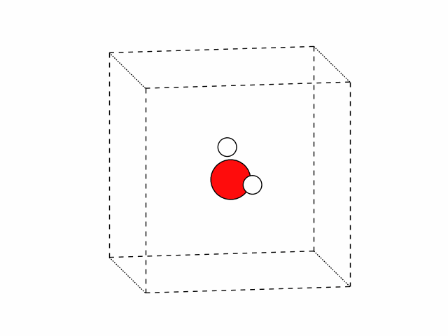
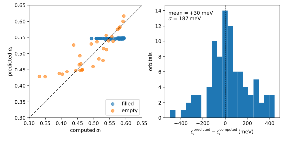

###########################################
 Screening parameters from a trained model
###########################################

Computing the screening parameters is the expensive part of a Koopmans calculation. When
you have many similar systems to get through — snapshots along a molecular-dynamics
trajectory, say — you can train a model on a few of them and predict the rest. This
tutorial trains a model on a handful of water configurations, checks it against
configurations it has never seen, and then runs a calculation with the model's
prediction in place of the step it replaces.

The twenty configurations are one water molecule with its atoms displaced at random.
:download:`generate_snapshots.py <generate_snapshots.py>` writes them as two multi-frame
xyz files: five to train on, and fifteen to test and predict with.

    The twenty configurations of water used in this tutorial.

.. note::

    A model like this earns its keep in liquids and solids, so the tutorial works the
    way a calculation on one would: the molecule sits in a periodic box, and the
    variational orbitals are maximally localized Wannier functions rather than Kohn-Sham
    orbitals. This toy system is of course neither periodic nor extended.

The ``ml`` block of the input file picks one of three modes:

``train``
    computes the screening parameters of every configuration and fits a model to them;

``test``
    computes them *and* predicts them, and reports how far apart the two are;

``predict``
    predicts them, and never computes them.

They are presented in that order deliberately. The prediction is only worth having if
you know what it costs you in accuracy, and for this system that turns out to be the
interesting part.

******************
 Training a model
******************

Download :download:`train.yaml <train.yaml>` and :download:`training_snapshots.xyz
<training_snapshots.xyz>` into an empty directory. Here is the input file in full:

.. literalinclude:: train.yaml
    :language: yaml

.. warning::

    The cell, the cutoff and the k-point sampling in these files are deliberately rough,
    so that the tutorial finishes in a reasonable time. They are not converged! Use
    these files to learn the input format, not as something to copy-paste for production
    work.

Most of this file describes an ordinary Koopmans calculation, of the kind :doc:`the
ozone tutorial <../orbital_energies/ozone/automatically>` walks through. Three things
are new.

.. literalinclude:: train.yaml
    :language: yaml
    :start-at: task: trajectory
    :end-at: task: trajectory

runs one such calculation per configuration rather than one in total.

.. literalinclude:: train.yaml
    :language: yaml
    :start-at: snapshots:
    :end-at: snapshots:

names the configurations, as a multi-frame xyz file in place of the ``atomic_positions``
block a single-structure calculation carries. Every frame shares the cell, the
composition and the projections that the rest of the file gives.

.. literalinclude:: train.yaml
    :language: yaml
    :start-at: mode: train
    :end-at: occ_and_emp_together

is the model. ``descriptor`` decides what the model sees of an orbital: with
``self_hartree`` it sees a single number, the electrostatic self-interaction energy of
that orbital's density, which the calculation prints anyway and which therefore costs
nothing to collect. (The other option, ``power_spectrum``, describes each orbital density
in far more detail — see the question below.) ``estimator`` decides how the model fits
screening parameters to that number, and ``occ_and_emp_together: false`` fits the filled
and the empty orbitals separately — one screening parameter says what happens when an
electron leaves an orbital, the other what happens when one arrives, and the two need
not be related.

.. warning::

    Make sure you have installed ``koopmans``: see :doc:`here <../../installation>` for
    more details.

    This workflow needs ``pw.x``, ``wannier90.x``, ``pw2wannier90.x``, ``wann2kcp.x``,
    ``merge_evc.x`` and ``kcp.x``.

Run the calculation with

.. code-block:: console

    $ koopmans run train.yaml

The progress table now has one branch per configuration, each of them a complete
Koopmans calculation:

.. code-block:: text

     Step                                                                      Status
     Trajectory                                                               finished
       Snapshot 1                                                             finished
         Wannier initialization                                              finished
           Wannierization                                                    finished
           Supercell folding                                                 finished
           DFT staging                                                       finished
           DFT initialization                                                finished
         Screening parameters                                                finished
           Iteration 1                                                       finished
             Trial KI                                                        finished
             Orbital screening                                               finished
               Orbital 1                                                     finished
               ...
               Orbital 6                                                     finished
         RunFinalKI                                                          finished
       Snapshot 2                                                            finished
         ...
       Snapshot 5                                                            finished

    Workflow completed successfully!
    Trained model stored as node 125246 (…) — reference it via `ml: {model: 125246}`.

The last line is the point of the whole run. The model is a node in the engine's
database, and later runs name it by that id; your own run will print an id of its own.
The model is also written to ``train/model.json``, which is the same thing in a form you
can read:

.. code-block:: json

    {
      "descriptor": "self_hartree",
      "estimator_type": "ridge_regression",
      "occ_and_emp_together": false,
      "correction": "ki",
      "init_orbitals": "mlwfs",
      "submodels": {
        "occ": {
          "estimator_type": "ridge_regression",
          "x_mean": [11.44355],
          "x_scale": [0.70535710636528],
          "coef": [-0.001139277833645],
          "intercept": 0.54618910176865
        },
        "emp": {
          "estimator_type": "ridge_regression",
          "x_mean": [3.8872],
          "x_scale": [0.87494946139763],
          "coef": [0.052062930603865],
          "intercept": 0.50597342953171
        }
      }
    }

Two submodels, one for the filled orbitals and one for the empty, each a straight line
through the training data: a screening parameter is ``intercept`` plus ``coef`` times
the self-Hartree energy, once that energy has been shifted by ``x_mean`` and scaled by
``x_scale``.

.. question:: What does the filled-orbital submodel actually predict?

    Almost the same number whatever it is given. Its coefficient is small enough that
    moving the self-Hartree energy across the whole range the training set covers changes
    the predicted screening parameter in the fourth decimal place, so in practice the
    submodel returns its intercept, 0.546 — the mean of the filled orbitals' screening
    parameters in the training set. The empty-orbital submodel, whose coefficient is
    forty-five times larger, does vary with what it is given. Keep both in mind when
    reading the next section.

.. note::

    The model records the physics it was fitted under — ``correction``,
    ``init_orbitals``, ``descriptor``. A later run that asks it to predict screening
    parameters for a different functional, or for orbitals of a different kind, is
    refused rather than answered.

*******************
 Testing the model
*******************

A model that has only ever been checked against its own training data tells you nothing.
Download :download:`test.yaml <test.yaml>` and :download:`testing_snapshots.xyz
<testing_snapshots.xyz>` into the same directory as ``train.yaml`` — ``model_file:
train/model.json`` is a relative path, read against the training run's own output
folder — and run

.. code-block:: console

    $ koopmans run test.yaml

The input file differs from ``train.yaml`` in two places — it reads the other fifteen
configurations, and its ``ml`` block is

.. literalinclude:: test.yaml
    :language: yaml
    :start-at: mode: test
    :end-at: occ_and_emp_together

.. note::

    ``model_file`` reads the model out of the JSON file the training run wrote. ``model:
    125246`` instead names the model node in the database — the id that the training run
    printed — which has the advantage that the engine records where the prediction came
    from. The two are alternatives; giving both is an error.

A test run does everything the training run did, computing every screening parameter
from first principles, and then does two things more: it predicts every screening
parameter too, and it runs a *second* final KI calculation with the predicted values in
place of the computed ones. That second calculation shows up at the end of each
configuration's branch:

.. code-block:: text

    Snapshot 1                                                             finished
      ...
      RunFinalKI                                                           finished
      Final KI (predicted alphas)                                         finished

Both start from the same trial calculation and differ only in the screening parameters,
so whatever separates their orbital energies is the model's doing and nothing else.

:download:`plot_screening_accuracy.py <plot_screening_accuracy.py>` reads the two of
them out of every configuration's output directory and plots the comparison:

    Left: the predicted screening parameters against the computed ones, for the 90
    orbitals of the fifteen test configurations; a point on the dashed line is predicted
    perfectly. Right: the difference the prediction makes to the orbital energies of the
    final KI calculation.

The screening parameters are predicted to about 0.03 — a mean error of 0.000, a spread
of 0.033, the worst orbital out by 0.097, on parameters that range from 0.33 to 0.59.
The left-hand panel shows where that error comes from: the empty orbitals follow the
diagonal loosely, while the filled ones sit on a horizontal line, every one of them
predicted at 0.546 whatever its true value. This is the constant submodel from the
previous section, seen from the outside.

The right-hand panel is what that costs. The orbital energies move by 187 meV RMS, and
by as much as 0.5 eV for individual orbitals.

.. question:: Why does a 5% error in a screening parameter become a 0.2 eV error in an orbital energy?

    Because the screening parameter scales a correction of several electronvolts — the
    self-Hartree part of it alone averages 11 eV over these orbitals. An error of 0.03 in
    a parameter multiplying a quantity that size is a few hundred meV in the energy, which
    is what the histogram shows. A few per cent on a screening parameter is not
    automatically good enough; what matters is the energy that comes out of it.

.. question:: Does training on ten configurations instead of five do better?

    Barely, and not in the direction you would hope. Set ``N_TRAIN = 10`` in
    ``generate_snapshots.py``, regenerate the two xyz files, and repeat the training and
    testing runs: the screening parameters come out with a spread of 0.035 and a typical
    error of 0.028, against 0.033 and 0.027 from five configurations. The extra
    calculations bought nothing.

    That is what a one-number descriptor gets you. The model is a straight line in a
    single variable, so five configurations already pin it down; what is missing is not
    data but a description of the orbital rich enough to distinguish orbitals whose
    screening differs. Adding training configurations cannot supply that.

.. question:: Does the ``power_spectrum`` descriptor do better?

    Much better. Add ``descriptor: power_spectrum`` to the ``ml`` block of every input
    above, plus the radial basis it expands each orbital's density on —
    ``n_max: 6``, ``l_max: 6``, ``r_min: 1.0``, ``r_max: 4.0`` — and repeat the training
    and testing runs. The Wannier-seeded initialization this tutorial already runs
    supplies everything the descriptor needs (the per-block Wannierizations and a
    ``pw2wannier90.x`` decompose pass); nothing else about the input files changes.

    On the same five-configuration training set and fifteen-configuration test, the
    screening parameters come out with a spread of 0.015 — under half of
    ``self_hartree``'s 0.033 — and the final KI orbital energies move by 29 meV RMS, at
    most 83 meV, against 187 meV RMS and 0.5 eV. That is close to the legacy tutorial's
    own published error on the same split, 33 meV, measured with a different
    orbital-density descriptor of comparable detail. A one-number descriptor is cheap
    and easy to explain; a richer one is what you would actually use.

    Both descriptors work in every ``ml`` mode, including ``predict``.

*****************
 Using the model
*****************

Download :download:`predict.yaml <predict.yaml>` into the same directory as
``train.yaml``, for the same reason as ``test.yaml`` above, and run

.. code-block:: console

    $ koopmans run predict.yaml

Its ``ml`` block is

.. literalinclude:: predict.yaml
    :language: yaml
    :start-at: mode: predict
    :end-at: occ_and_emp_together

and this time the screening parameters are never computed. Each configuration runs one
trial KI calculation, which is where the self-Hartree energies come from, the model
turns those into screening parameters, and the final KI calculation applies them:

.. code-block:: text

    Snapshot 1                                                             finished
      Wannier initialization                                              finished
      Predicted screening parameters                                     finished
        Trial KI                                                          finished
      RunFinalKI                                                           finished

Compare that with the training run's branch: the whole ``Orbital screening`` fan-out,
one constrained calculation per orbital, is gone. What remains — the Wannierization,
the initialization, the trial and the final calculation — is what sets the floor on
how cheap a predicted Koopmans calculation can be.

.. warning::

    And it is worth being clear about what these particular predictions are worth: on
    this system they moved the orbital energies by 187 meV RMS. Predict on a system you
    have tested, and read the test before you trust the prediction.

*************
 The outputs
*************

As in every other tutorial, the results land in a directory named after the input file,
here with one subdirectory per configuration:

.. code-block:: text

    test
    ├── 01-dscf_snapshot_1
    │   ├── 01-count_electrons_task
    │   ├── 02-wannier_initialization
    │   ├── 03-ComputeScreeningParameters
    │   ├── 04-RunFinalKI
    │   ├── 05-run_final_ki_predicted
    │   └── outputs                            # this snapshot's own alphas, eigenvalues, ...
    ├── ...
    ├── 15-dscf_snapshot_15
    ├── 16-alpha_and_eigenvalue_deltas_snapshot_1-compare_final_kis
    ├── ...
    ├── 30-alpha_and_eigenvalue_deltas_snapshot_15-compare_final_kis
    ├── model.json
    ├── outputs
    │   ├── datasets.json
    │   ├── evaluation.json                    # metrics, predictions, alpha_and_eigenvalue_deltas
    │   ├── model.json
    │   └── snapshots.json
    └── README

Each configuration's subdirectory holds the same steps a single Koopmans calculation
writes, and — in a test run only — the second final KI calculation beside the first. The
``compare_final_kis`` steps that follow are the per-configuration comparisons the figure
above summarizes. ``model.json`` at the root is the model the run used; the same content
sits again inside ``outputs/``, which is where the whole run's own results land —
including ``evaluation.json``, read below.

**********************
 Reading the verdict
**********************

A test run's verdict on its model is ``outputs/evaluation.json``:

.. code-block:: console

    $ python -c "import json; print(json.load(open('test/outputs/evaluation.json'))['metrics'])"
    {'n_samples': 90, 'mae': 0.027207865435438, 'rmse': 0.032752078844741, 'max_abs_error': 0.096675353075518}

Its ``predictions`` key carries every orbital's predicted and computed screening
parameter, and ``alpha_and_eigenvalue_deltas`` each configuration's pair of final KI
calculations — the same numbers the plot above is made from. A training run reports
metrics too, but they are measured on the configurations the model was fitted to, so
they say how well the line fits, not how well it predicts. A ``predict`` run computes no
comparison and writes no ``evaluation.json`` — there is nothing to evaluate against.

The same file loads as a Python dict without going through the output directory at all:

.. code-block:: python

    from koopmans import read_input_file, run

    results = run(read_input_file("test.yaml"))

    metrics = results["evaluation"]["metrics"]
    print(f"typical screening-parameter error: {metrics['mae']:.3f}")  # 0.027
