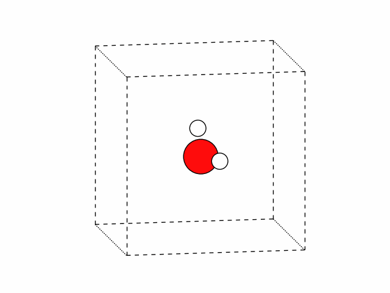
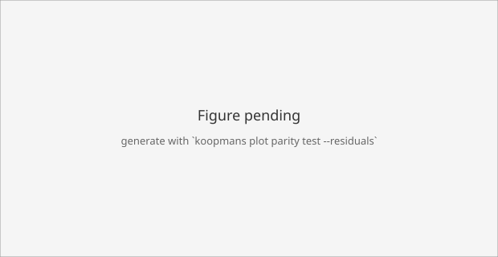

###########################################
 Screening parameters from a trained model
###########################################

Computing the screening parameters is the expensive part of a Koopmans calculation. When
you have many similar systems — snapshots along a molecular-dynamics
trajectory, say — it is a waste of time to repeatedly compute screening parameters
for what are ultimately very similar orbitals and screening environments. In this case,
you can train a model on a few systems and use it to predict the screening parameters for
the rest. This tutorial trains a model on a handful of water molecules, checks it against
configurations it has never seen, and then runs a calculation with the model's predictions
in place of explicit screening parameter calculations.

.. note::

    This machine-learning approach was first published in :cite:`Schubert2024` --- read that
    paper for all of the details!

The twenty configurations are one water molecule with its atoms displaced at random.
:download:`generate_snapshots.py <generate_snapshots.py>` writes them as two multi-frame
xyz files: five to train on, and fifteen to test and predict with.

    The twenty configurations of water used in this tutorial.

.. note::

    A model like this earns its keep for liquids and solids, while here we apply
    it to a molecule for demonstration purposes. For this reason, we will treat
    the system like a liquid or a solid:

    - the molecule sits in a box with periodic boundary conditions
    - we use maximally localized Wannier functions for the variational orbitals rather than Kohn-Sham orbitals.

The key settings are found in the ``ml`` block. We can choose one of three modes:

``train``
    computes the screening parameters of every configuration and fits a model to them;

``test``
    computes them *and* predicts them, and reports how far apart the two are;

``predict``
    predicts them, and never computes them.

We will go through each of these in turn.

******************
 Training a model
******************

Download :download:`train.yaml <train.yaml>` and :download:`training_snapshots.xyz
<training_snapshots.xyz>` into an empty directory. Here is the input file in full:

.. literalinclude:: train.yaml
    :language: yaml

.. warning::

    The cell, the cutoff and the k-point sampling in these files are deliberately rough,
    so that the tutorial finishes in a reasonable time. They are not converged! Use
    these files to learn the input format, not as something to copy-paste for production
    work.

Most of this file describes an ordinary Koopmans calculation, of the kind :doc:`the
ozone tutorial <../orbital_energies/ozone/automatically>` walks through. Two things
are new.

.. literalinclude:: train.yaml
    :language: yaml
    :start-at: snapshots:
    :end-at: snapshots:

means we run one calculation on each of the configurations found in this multi-frame xyz
file in place of the ``atomic_positions`` block we have been using for single-structure
calculations. Every frame shares the same cell, composition, and so on. Meanwhile, the
``ml`` block:

.. literalinclude:: train.yaml
    :language: yaml
    :start-at: ml:
    :end-at: occ_and_emp_together

defines the model. ``descriptor`` decides what the model sees of an orbital: ``power_spectrum``
expands each orbital's density on a radial basis out to ``r_max``, with radial channels
up to ``n_max`` and angular momenta up to ``l_max``, and feeds the model the rotationally
invariant power spectrum of that expansion. (The cheaper
alternative, ``self_hartree``, sees only the electrostatic self-interaction energy of
that density; we will discuss it later.) ``estimator`` decides how the model fits screening parameters to
the descriptor, and ``occ_and_emp_together: false`` fits the filled and the empty
orbitals separately — one screening parameter says what happens when an electron leaves
an orbital, the other what happens when one arrives, and the two need not be related.

Run the calculation with

.. code-block:: console

    $ koopmans run train.yaml

The progress table has one branch per configuration, each of them a complete
Koopmans calculation, plus a second branch per configuration that builds the
``power_spectrum`` dataset the model is fitted to:

.. code-block:: text

     Step                                                                      Status
     Trajectory                                                              finished
       Snapshot 1                                                            finished
         Wannier initialization                                              finished
           Wannierization                                                    finished
           Supercell folding                                                 finished
           DFT staging                                                       finished
           DFT initialization                                                finished
         Screening parameters                                                finished
           Iteration 1                                                       finished
             Trial KI                                                        finished
             Orbital screening                                               finished
               Orbital 1                                                     finished
               ...
               Orbital 6                                                     finished
         Final KI                                                            finished
       Descriptors (snapshot 1)                                              finished
       Snapshot 2                                                            finished
         ...
       Descriptors (snapshot 2)                                              finished
       ...
       Snapshot 5                                                            finished
       Descriptors (snapshot 5)                                              finished

    Workflow completed successfully!
    Trained model stored as node 254978 (…) — reference it via `ml: {model: 254978}`.

Each ``Descriptors (snapshot N)`` branch is a ``pw2wannier90.x`` decompose pass over
that configuration's own Wannierization, paired with the screening parameters the
``Snapshot N`` branch above it already computed. ``self_hartree`` needs no such
pass — its descriptor is read straight off the final KI calculation — so it never adds
this branch.

The last line is the point of the whole run. The model is a node in the engine's
database, and later runs name it by that id; your own run will print an id of its own.
The model is also written to ``train/model.json``, which is the same thing in a form you
can read. Most of it is not worth reading by eye — the ``power_spectrum`` descriptor
expands each orbital over 441 radial-angular channels, so each submodel carries 441
coefficients — but the stamps at the top are:

.. code-block:: json

    {
      "descriptor": "power_spectrum",
      "estimator_type": "ridge_regression",
      "occ_and_emp_together": false,
      "correction": "ki",
      "init_orbitals": "mlwfs",
      "n_max": 6,
      "l_max": 6,
      "r_min": 1.0,
      "r_max": 4.0,
      "submodels": {
        "occ": {
          "estimator_type": "ridge_regression",
          "intercept": 0.546186
        },
        "emp": {
          "estimator_type": "ridge_regression",
          "intercept": 0.505976
        }
      }
    }

Two submodels, one for the filled orbitals and one for the empty, each a ridge
regression through the training data: a screening parameter is ``intercept`` plus a
dot product of ``coef`` with the 441-entry power spectrum, once that vector has been
shifted by ``x_mean`` and scaled by ``x_scale`` — the same recipe as ``self_hartree``,
just with many more numbers standing in for the one.

.. note::

    The model records the physics it was fitted under — ``correction``,
    ``init_orbitals``, ``descriptor`` and, for ``power_spectrum``, the radial basis
    (``n_max``, ``l_max``, ``r_min``, ``r_max``). A later run that asks it to predict
    screening parameters for a different functional, orbitals of a different kind, or a
    different radial basis, is refused rather than answered.

*******************
 Testing the model
*******************

A model that has only ever been checked against its own training data tells you nothing.
Download :download:`test.yaml <test.yaml>` and :download:`testing_snapshots.xyz
<testing_snapshots.xyz>` into the same directory as ``train.yaml`` — ``model_file:
train/model.json`` is a relative path, read against the training run's own output
folder — and run

.. code-block:: console

    $ koopmans run test.yaml

The input file differs from ``train.yaml`` in two places — it reads the other fifteen
configurations, and its ``ml`` block is

.. literalinclude:: test.yaml
    :language: yaml
    :start-at: mode: test
    :end-at: occ_and_emp_together

.. note::

    ``model_file`` reads the model out of the JSON file the training run wrote. ``model:
    254978`` instead names the model node in the database — the id that the training run
    printed — which has the advantage that the engine records where the prediction came
    from. The two are alternatives; giving both is an error.

A test run does everything the training run did, computing every screening parameter
from first principles, and then does two things more: it predicts every screening
parameter too, from a second decompose pass off the same trial calculation, and it runs
a *second* final KI calculation with the predicted values in place of the computed ones.
Both show up inside each configuration's branch:

.. code-block:: text

    Snapshot 1                                                               finished
      ...
      Descriptors                                                            finished
      Final KI                                                               finished
      Final KI (predicted alphas)                                            finished
    Descriptors (snapshot 1)                                                 finished
    ...

The nested ``Descriptors`` is the model's own input — the decompose pass that feeds the
predicted alphas above it — and runs alongside the trial KI rather than after it, since
it takes nothing from that calculation. The ``Descriptors (snapshot N)`` branches
outside every snapshot are the same dataset-building pass ``train.yaml`` ran: a test run
also pairs its (real, computed) descriptors with its (real, computed) alphas, so its own
output can be folded into a later training run as more data.

The two final KI calculations both start from the same trial calculation and differ
only in the screening parameters, so whatever separates their orbital energies is the
model's doing and nothing else. ``test/outputs/evaluation.json`` carries every orbital's
computed and predicted screening parameter, and every configuration's pair of final KI
eigenvalues, for exactly this comparison (see :ref:`ml-verdict` below); a figure
generated with ``koopmans plot parity`` reads the same file:

.. code-block:: console

    $ koopmans plot parity test --residuals

    Left: the predicted screening parameters minus the computed ones, against the
    computed value, for the 90 orbitals of the fifteen test configurations, with a
    marginal histogram of the residual. Right: the same, for the orbital energies of
    the final KI calculation.

Over the 90 orbitals of the fifteen test configurations, the screening parameters come
out with a mean absolute error of 0.0075 and a root-mean-square error of 0.0145, the
worst orbital out by 0.074, on parameters that range from 0.33 to 0.59. That error is
not shared evenly: the four filled orbitals of each configuration average an error of
0.0018, the two empty orbitals 0.0188 — an order of magnitude apart.

What that costs in the final KI: the fifteen configurations' orbital energies move by a
root-mean-square of 26.7 meV on average, 27.0 meV at the median, and as much as 55 meV
for the worst configuration; no single orbital in the whole set moves by more than 82
meV. The figure pools all 180 orbital energies instead of averaging per configuration,
which is why it reports 21 meV mean absolute and 29 meV root-mean-square.

.. question:: Why does a percent-level error in a screening parameter move an orbital energy by tens of meV?

    Because the screening parameter scales a correction of several electronvolts — the
    self-Hartree part of it alone averages 11 eV over these orbitals — even the small
    error the power-spectrum descriptor leaves is consistent with an energy shift of a
    few tens of meV. What matters for the final answer is the energy that comes out of
    the screening parameter, not the parameter's own error in isolation.

.. question:: Does the cheaper ``self_hartree`` descriptor do just as well?

    No. Set ``descriptor: self_hartree`` in the ``ml`` block of every input above,
    dropping ``n_max``/``l_max``/``r_min``/``r_max`` (``self_hartree`` carries no radial
    basis), and repeat the training and testing runs. On the same five-configuration
    training set and fifteen-configuration test set, the screening parameters come out
    with a mean absolute error of 0.0272, a root-mean-square error of 0.0327, and a
    worst orbital out by 0.097 — more than twice ``power_spectrum``'s error on every
    measure. The final KI orbital energies move by a root-mean-square of 186.5 meV on
    average across the fifteen configurations, and by as much as 495 meV for a single
    orbital.

    The reason is visible in the model itself: ``self_hartree`` sees one number per
    orbital, so its filled-orbital submodel has one coefficient to work with. That
    coefficient is small enough that moving the self-Hartree energy across the whole
    range the training set covers — 10.0 to 13.5 eV — only moves the prediction from
    0.548 to 0.543, a shift in the third decimal place; in practice the submodel returns
    close to its intercept whatever it is asked. ``power_spectrum``'s 441 features give
    its filled-orbital submodel enough to work with that its error (0.0018) sits an order
    of magnitude below its own empty-orbital error, rather than collapsing to a
    constant.

    Training ``self_hartree`` on ten configurations instead of five does not fix this:
    the screening parameters come out with a root-mean-square error of 0.035, no better
    than five configurations' 0.033. A one-number descriptor's limit is what it can
    distinguish between orbitals, not how much data it is fitted to.

    Both descriptors work in every ``ml`` mode, including ``predict``.

*****************
 Using the model
*****************

Download :download:`predict.yaml <predict.yaml>` into the same directory as
``train.yaml``, for the same reason as ``test.yaml`` above, and run

.. code-block:: console

    $ koopmans run predict.yaml

Its ``ml`` block is

.. literalinclude:: predict.yaml
    :language: yaml
    :start-at: mode: predict
    :end-at: occ_and_emp_together

and this time the screening parameters are never computed. Each configuration runs a
decompose pass and a trial KI calculation side by side, the model turns the descriptor
into screening parameters, and the final KI calculation applies them:

.. code-block:: text

    Snapshot 1                                                               finished
      Wannier initialization                                                 finished
      Predicted screening parameters                                         finished
        Descriptors                                                          finished
        Trial KI                                                             finished
      Final KI                                                               finished

Compare that with the training run's branch: the whole ``Orbital screening`` fan-out,
one constrained calculation per orbital, is gone. What remains — the Wannierization,
the initialization, the descriptor pass, the trial and the final calculation — is what
sets the floor on how cheap a predicted Koopmans calculation can be.

.. warning::

    And it is worth being clear about what these particular predictions are worth: on
    this system, testing this model moved the final KI orbital energies by a
    root-mean-square of up to 55 meV per configuration, and by as much as 82 meV for a
    single orbital. Predict on a system you have tested, and read the test before you
    trust the prediction.

*************
 The outputs
*************

As in every other tutorial, the results land in a directory named after the input file,
here with one subdirectory per configuration:

.. code-block:: text

    test
    ├── 01-dscf_snapshot_1
    │   ├── 01-count_electrons_task
    │   ├── 02-wannier_initialization
    │   ├── 03-ComputeScreeningParameters
    │   ├── 04-predicted_descriptors
    │   ├── 05-RunFinalKI
    │   ├── 06-run_final_ki_predicted
    │   └── outputs                            # this snapshot's own alphas, eigenvalues, ...
    ├── ...
    ├── 15-dscf_snapshot_15
    ├── 16-alpha_and_eigenvalue_deltas_snapshot_6-compare_final_kis
    ├── 17-alpha_and_eigenvalue_deltas_snapshot_8-compare_final_kis
    ├── 18-descriptors_snapshot_6
    ├── 19-descriptors_snapshot_8
    ├── ...
    ├── 45-descriptors_snapshot_9
    ├── model.json
    ├── outputs
    │   ├── datasets.json
    │   ├── evaluation.json                    # metrics, predictions, alpha_and_eigenvalue_deltas
    │   ├── model.json
    │   ├── snapshots
    │   └── snapshots.json
    └── README

Each configuration's subdirectory holds the same steps a single Koopmans calculation
writes, plus — in a test run only — the second final KI calculation beside the first,
and its own descriptor pass beside that. The ``compare_final_kis`` and
``descriptors_snapshot_N`` folders that follow are per-configuration: the comparison
the figure above summarizes, and the dataset-building pass described in the previous
section.

.. note::

    Those two families are numbered by the order the steps finished in, not by
    configuration — ``16`` and ``17`` are configurations 6 and 8, not 1 and 2. It is a
    dump-numbering quirk rather than something to read meaning into; do not expect the
    suffix and the number in front of it to agree past ``15``.

``model.json`` at the root is the model the run used; the same content sits again
inside ``outputs/``, which is where the whole run's own results land — including
``evaluation.json``, read below.

.. _ml-verdict:

**********************
 Reading the verdict
**********************

A test run's verdict on its model is ``outputs/evaluation.json``:

.. code-block:: console

    $ python -c "import json; print(json.load(open('test/outputs/evaluation.json'))['metrics'])"
    {'n_samples': 90, 'mae': 0.0074679288977794, 'rmse': 0.014536609775422, 'max_abs_error': 0.073690862672465}

Its ``predictions`` key carries every orbital's predicted and computed screening
parameter, and ``alpha_and_eigenvalue_deltas`` each configuration's pair of final KI
calculations — the same numbers the figure above is made from. A training run reports
metrics too, but they are measured on the configurations the model was fitted to (a mean
absolute error of 0.0002 here), so they say how well the line fits, not how well it
predicts. A ``predict`` run computes no comparison and writes no ``evaluation.json`` —
there is nothing to evaluate against.

The same file loads as a Python dict without going through the output directory at all:

.. code-block:: python

    from koopmans import read_input_file, run

    results = run(read_input_file("test.yaml"))

    metrics = results["evaluation"]["metrics"]
    print(f"typical screening-parameter error: {metrics['mae']:.4f}")  # 0.0075
